# The step 4a answers, and the second board

Answers 1, 3 and 4 are built (commits `4f36f7f`, `cbc5b3f`). Answer 2, the seven other projects as new pieces on a different board, is three comps. None of answer 2 is built yet. The positions on every board were checked in the site's own engine.

The questions are in the review doc, where you can answer them in place.

## Answer 1: Work to a project cuts the rest on landing

This applies only to Work to a project. The bishop stays put, and the plinth and the light change in one frame when the seam lands. Every other pair still lifts what is left. The frames run from 0 to 3.6 s, Work to FaultLine.

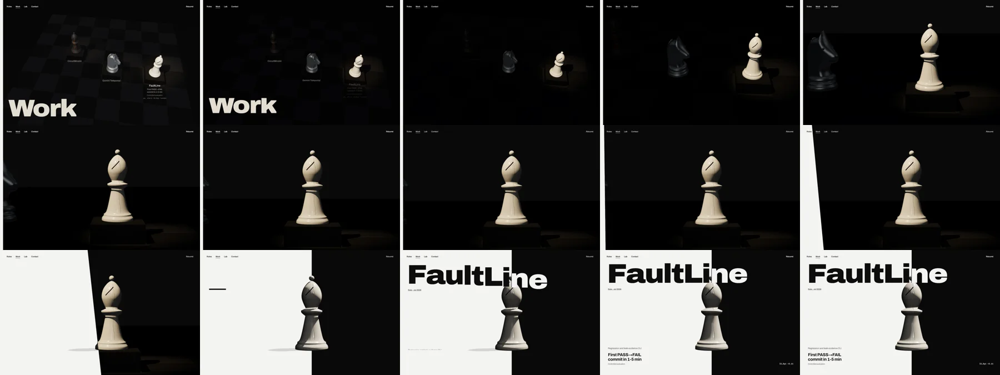

## Answer 3: the product, near the end of each case study

Each case study now ends with a captioned screenshot section, placed before the links. The heading "The product" is new copy.

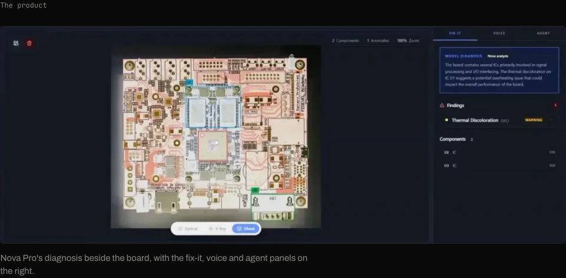
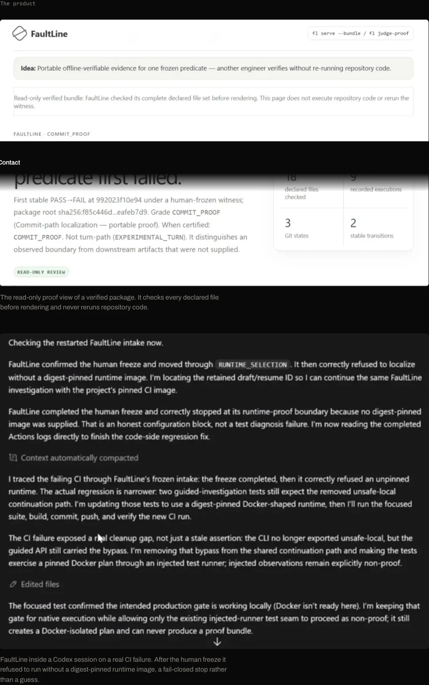
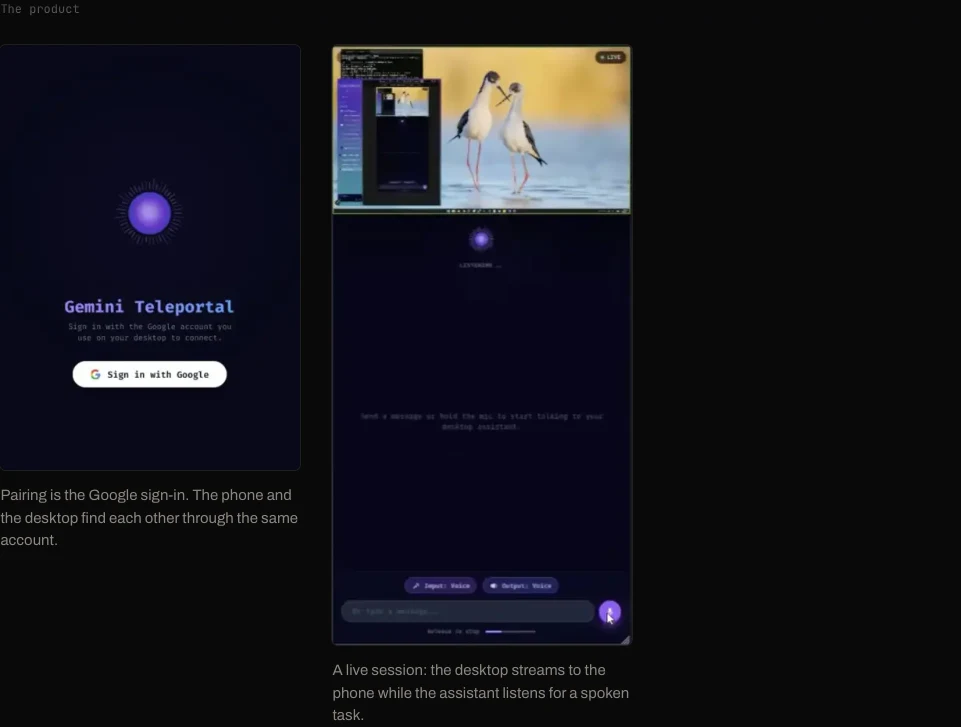

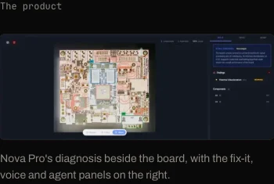 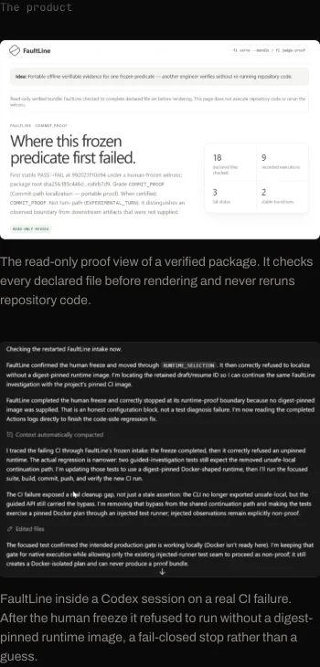 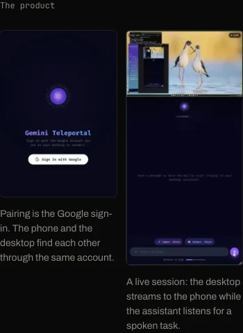

## Answer 4: annotations

The FaultLine and Teleportal drafts are gone. CircuitMindAI's decision now reads "Vision on the board and voice for the operator; results are cached locally …". CircuitMindAI's annotation is now the only one.

## Answer 2: seven new pieces

Each piece is its project's move in the career game.

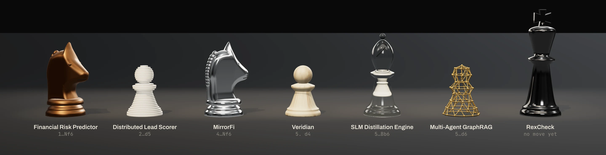

| Move | Project | Piece |
| --- | --- | --- |
| 1…Nf6 | Financial Risk Predictor | A cast bronze knight. The move is Alekhine's Defence, which is another game, so the knight stands off the board. |
| 2…d5 | Distributed Lead Scorer | An ivory pawn cut into thirty slices, each carrying its share (the Elephant Gambit). |
| 4…Nf6 | MirrorFi | A mirror-polished knight. |
| 5. d4 | Veridian | A pawn in pale ash. |
| 5…Bb6 | SLM Distillation Engine | A glass bishop with a small ivory bishop inside it: the 70B model around the 3B one. |
| 5…d6 | Multi-Agent GraphRAG | A pawn drawn as a graph, with brass edges between nodes on its surface. This is the "?" move. |
| none | RexCheck | An obsidian king. It has no move yet, and "rex" is Latin for king. |

## Comp A: every other line, on one board

A walnut board after 5. d4, with every sideline's move laid on it at once. The scoresheet on the left is the list. The two pieces that have no place on this board stand aside behind rank 8.

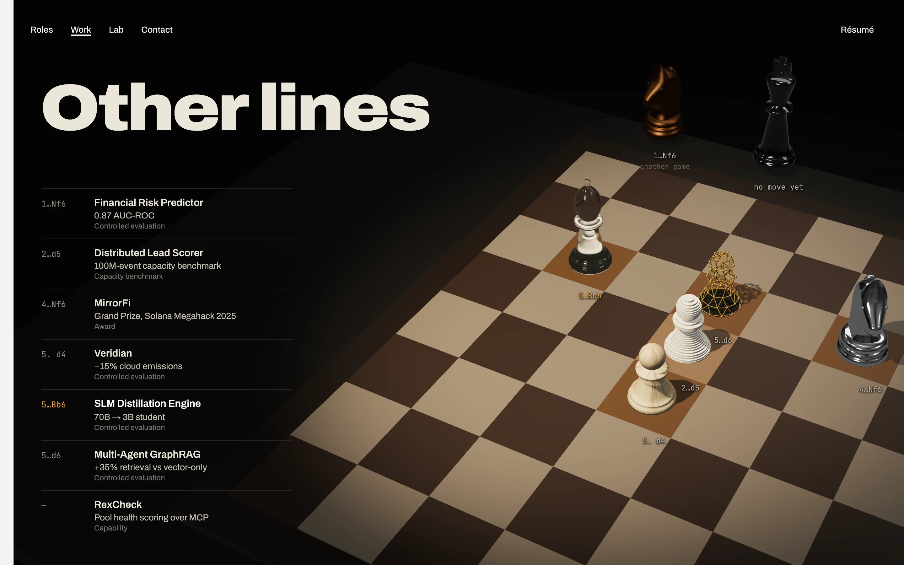
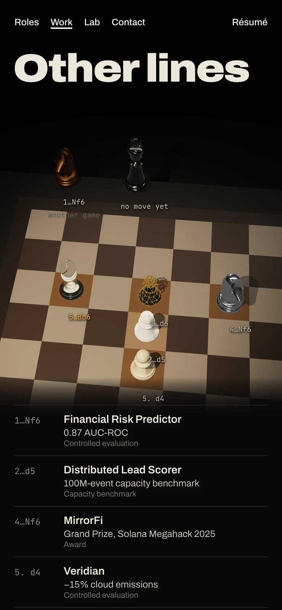

## Comp B: a simul, seven boards down one table

Each project gets its own board and position, lit where its piece stands. Scrolling walks the camera along the table.

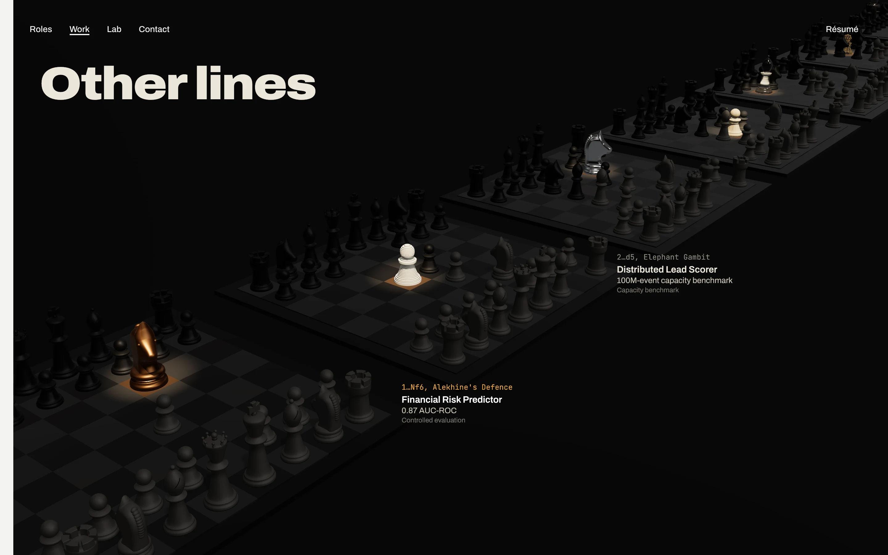
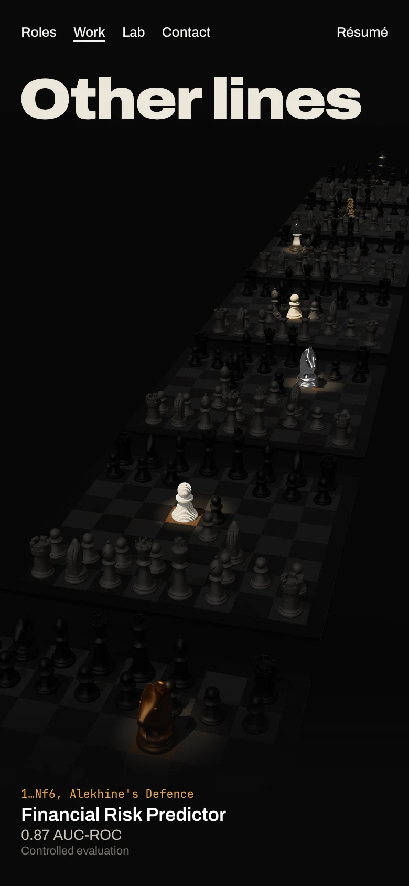

## Comp C: the analysis page

Comp A's layout on the paper side. The board is a printed diagram with only the seven pieces on it. The row being read turns its arrow amber.

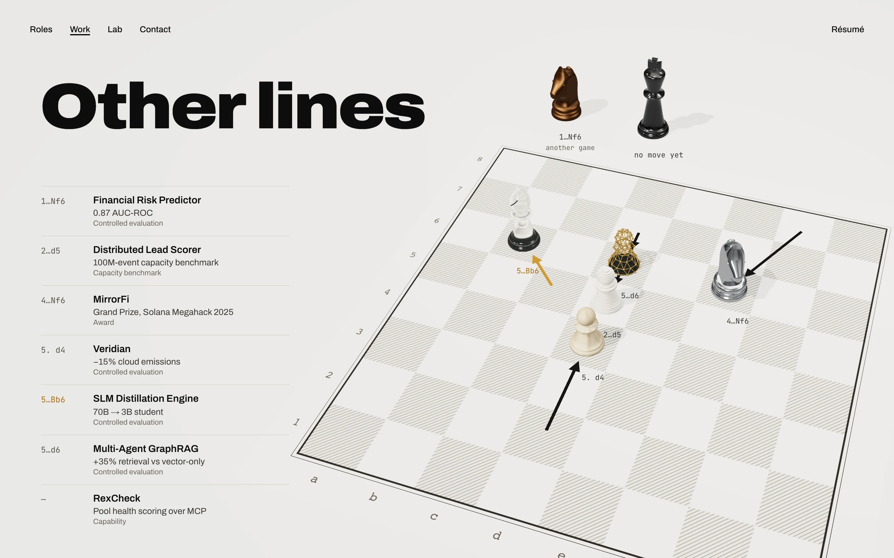
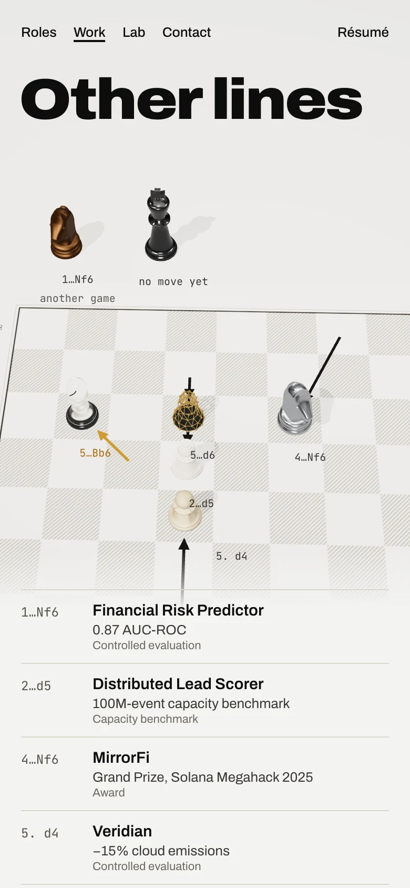
