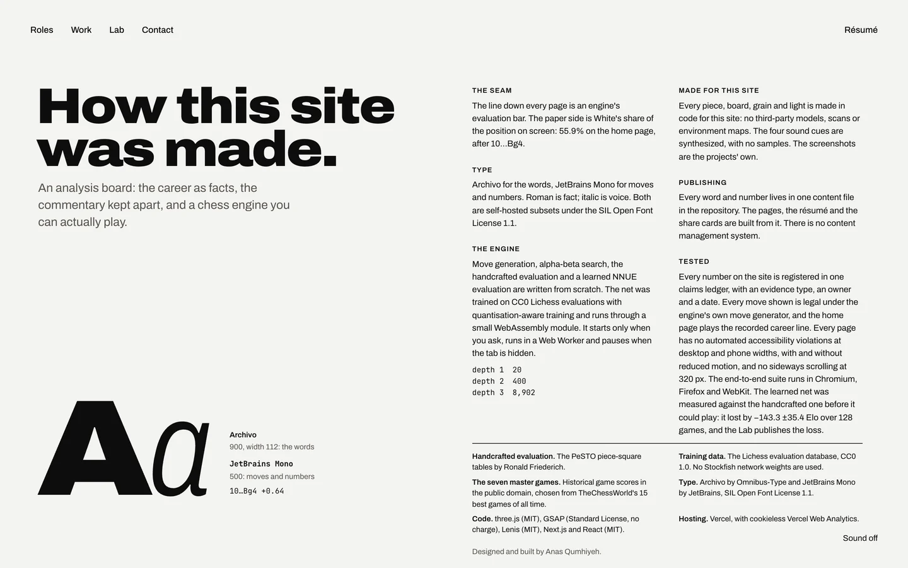
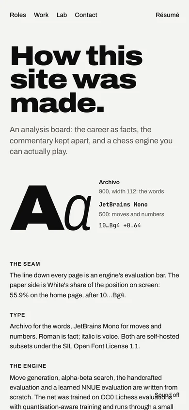
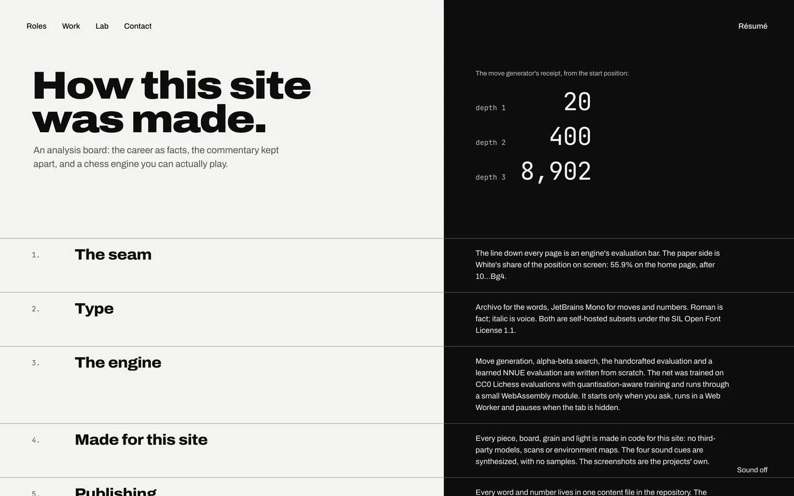
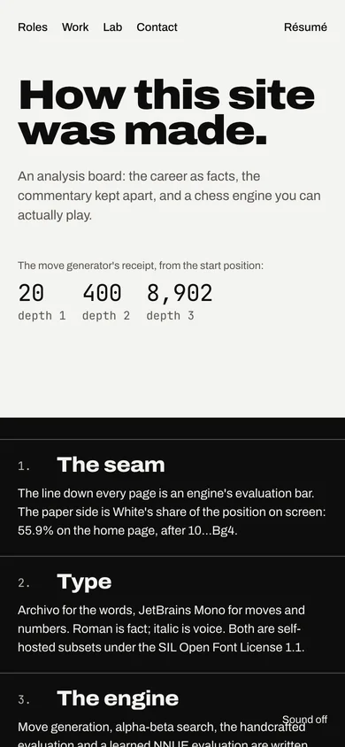
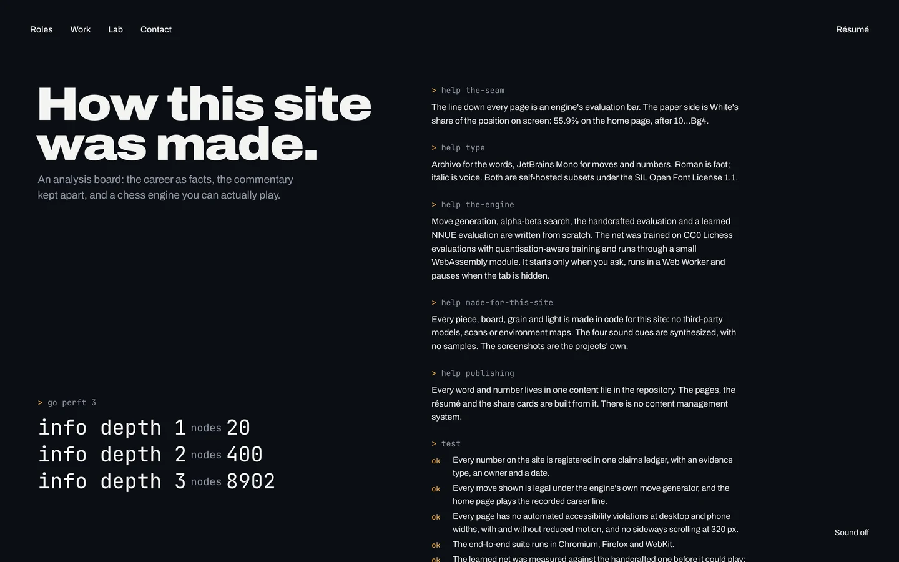
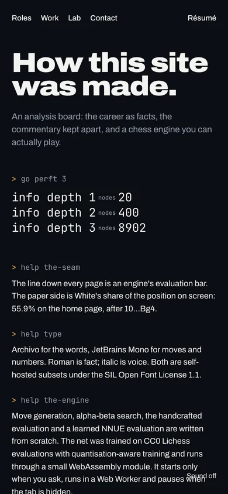

# Phase 6, step 4: the colophon

A page that says how the site was made, with its credits and licences. The v2 colophon in content.json no longer holds: it names React Three Fiber, drei, Zustand and Noto glyphs, which v3 does not use. So this is a new draft, checked against the code on 2026-09-30. Two lines are kept from v2 (marked kept); the rest is new copy for approval. Three layouts follow.

## The draft copy

**Title:** How this site was made.

**Lede (kept):** An analysis board: the career as facts, the commentary kept apart, and a chess engine you can actually play.

**The seam:** The line down every page is an engine's evaluation bar. The paper side is White's share of the position on screen: 55.9% on the home page, after 10…Bg4.

**Type:** Archivo for the words, JetBrains Mono for moves and numbers. Roman is fact; italic is voice. Both are self-hosted subsets under the SIL Open Font License 1.1.

**The engine:** Move generation, alpha-beta search, the handcrafted evaluation and a learned NNUE evaluation are written from scratch. The net was trained on CC0 Lichess evaluations with quantisation-aware training and runs through a small WebAssembly module. It starts only when you ask, runs in a Web Worker and pauses when the tab is hidden.

**Made for this site:** Every piece, board, grain and light is made in code for this site: no third-party models, scans or environment maps. The four sound cues are synthesized, with no samples. The screenshots are the projects' own.

**Publishing:** Every word and number lives in one content file in the repository. The pages, the résumé and the share cards are built from it. There is no content management system.

**The move generator's receipt, from the start position:** depth 1, 20; depth 2, 400; depth 3, 8,902.

**Tested:**

- Every number on the site is registered in one claims ledger, with an evidence type, an owner and a date. (kept)
- Every move shown is legal under the engine's own move generator, and the home page plays the recorded career line.
- Every page has no automated accessibility violations at desktop and phone widths, with and without reduced motion, and no sideways scrolling at 320 px.
- The end-to-end suite runs in Chromium, Firefox and WebKit.
- The learned net was measured against the handcrafted one before it could play: it lost by −143.3 ±35.4 Elo over 128 games, and the Lab publishes the loss.

**Credits:**

- **Handcrafted evaluation.** The PeSTO piece-square tables by Ronald Friederich. (kept)
- **Training data.** The Lichess evaluation database, CC0 1.0. No Stockfish network weights are used.
- **The seven master games.** Historical game scores in the public domain, chosen from TheChessWorld's 15 best games of all time.
- **Type.** Archivo by Omnibus-Type and JetBrains Mono by JetBrains, SIL Open Font License 1.1.
- **Code.** three.js (MIT), GSAP (Standard License, no charge), Lenis (MIT), Next.js and React (MIT).
- **Hosting.** Vercel, with cookieless Vercel Web Analytics.

**By:** Designed and built by Anas Qumhiyeh.

## A. The last page

The last page of a printed book. Paper floods. The title and a type specimen sit on the left; the notes are set in two columns on the right, with the credits as a printer's imprint below them.

## B. The scoresheet

The seam stands at the home page's 55.9%, between a scoresheet's two columns. Each note is a numbered row: its name on the paper side, its text on the dark side. The move generator's receipt stands large on the dark side. On phones the seam is level, the title above it and the rows below.

## C. The engine's receipt

The Lab's dark search palette floods. The site is read out like an engine's console: the perft receipt as the engine prints it, each note under a command, the tests as "ok" lines and the credits as the engine's id lines. The prompts are in the move's amber. The commands ("help the-seam", "test", "credits") are new copy too.

## Notes

- Each comp is the first screen of a page that scrolls; the rest of the notes continue below.
- On phones the page's text scrolls under the sound toggle, as on every long page.
- Comps: design/keyframes/colophon-{a,b,c}.html; the copy: design/keyframes/_shared/colophon.js.
