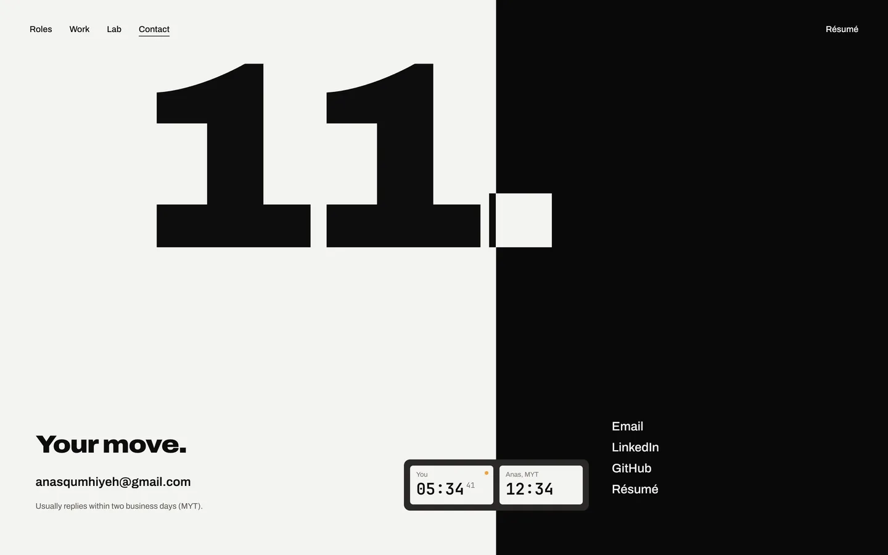
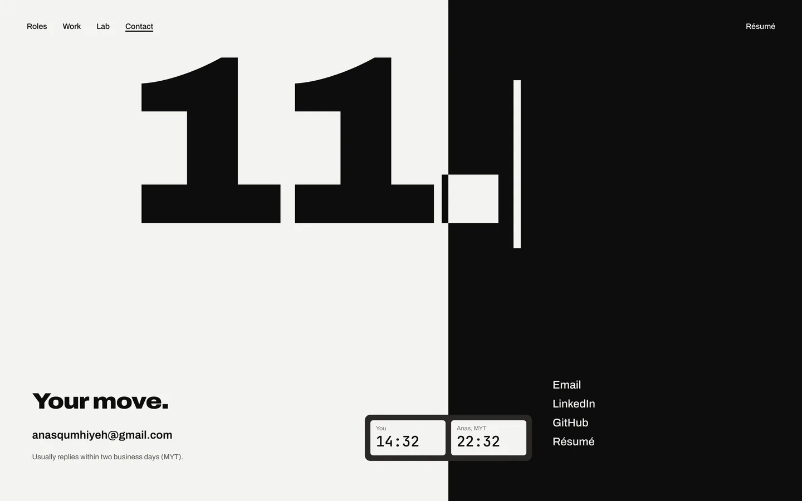
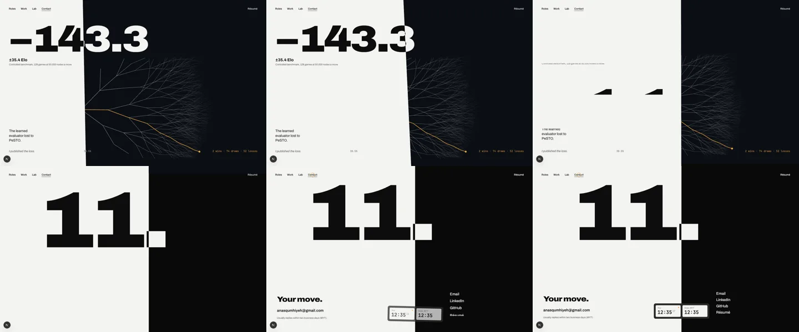
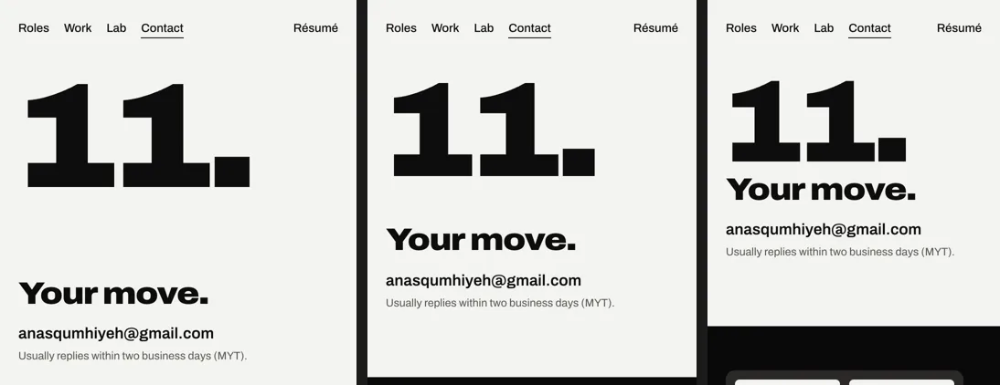
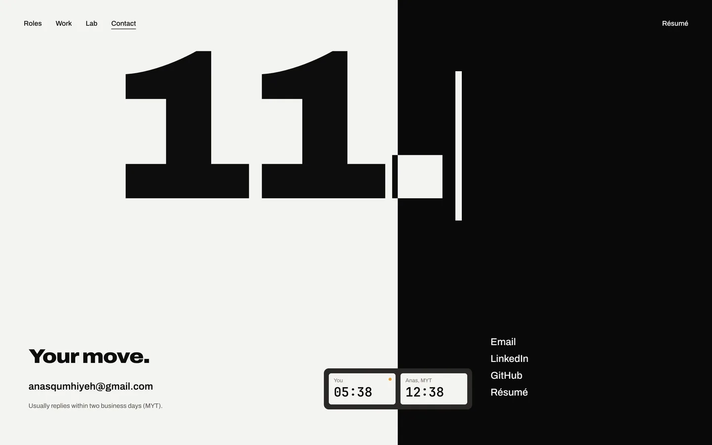

# Gate 5, step 4d: Contact

Contact (key frame contact-a, prototype `design/motion/contact.html`, storyboard `design/motion.md` §6) is built. Stills are from the dev build at 2×. The questions are in the review doc.

## Against its key frame

The seam rests at 55.9%, the position after 10…Bg4. The caret after "11." blinks at 1 Hz, hard on and off. Your face of the clock runs to the second with its flag lit, because it is your move. Anas's face stopped at the time in Kuala Lumpur when you arrived. The address underlines left to right on hover.

## Arriving, from the Lab

The seam sweeps to 55.9%, leaning as it travels. Then "11." rises, then the move, the address and the reply, and the links 50 ms apart, and the clock straightens as it lands. Frames at 0.3, 0.7, 1.0, 1.3, 1.7 and 2.3 s:

## On phones: 390 × 844, 360 × 740, 320 × 640

The seam is horizontal. "11." and "Your move." are on the white side; the clock and the links are on the black side. The type is placed from the seam, so shorter phones keep each part on its side.

## Reduced motion

Everything is in place, the caret is steady and the clock changes each minute, without seconds.

## Checks

- No sideways scrolling at 1440, 390, 360 and 320 px.
- Contact's tests: 6 of 6. The navigation test now expects Contact's h1 to be "11.". Unit tests 70 of 70, lint (src) and the production build pass.
