# Phase 6, step 3: the mark and the share card

The site has no favicon and no share card yet. Here are three directions, each a favicon and the card that goes with it. The questions are in the review doc.

Each sheet shows the favicon at the sizes a browser uses (16, 32 and 48 px), the home-screen icon, and the favicon in a light and a dark tab strip beside two other sites' tabs. The card is the image a link shows when it is shared (1200 × 630). Everything sits on the hero's seam, at 55.9%.

## A. The seam

The seam at 55.9% and nothing else: a square split paper and ink. The card is the name set across the seam as the hero sets it, with the tagline, the move and its score. It has no 3D, so the card is sharp at any size and quick to make for every page.

## B. The monogram

AQ in the display face, inverting across the seam as the name does. The card is the hero itself at rest, captured from the site: the name, the scattered pieces, 10…Bg4 +0.64. At 16 px the letters are close to unreadable.

## C. The piece

The site's own pawn, its lathe profile traced flat, standing on the seam with half of it inverted. The card is the career position after 10…Bg4 as a printed book diagram, on the seam, with the last move in amber. Each piece keeps its own colour on both sides of the seam, so the position reads correctly to a chess player.

## As a link preview

This is roughly the size a card appears at in a chat app.

  

## Notes

- The favicon ships as an SVG, with PNG fallbacks at 32 px and 180 px (the home screen). Mark B's letters would be converted to outlines, so the icon does not depend on the web font.
- The card's copy is the hero's own: the name, "I like systems that have to survive measurement." and "10…Bg4 +0.64". "anasqumhiyeh.dev" is new on the card.
- Card C's pieces are the system's chess symbols. For the real card I would draw them from the site's piece shapes instead, so they look the same on any machine.

## Round 2: the favicon

The owner turned down A, B and C for the favicon ("I don't like your designs") and picked card B, the hero, with one card per page. All three were the same idea, a square split by the seam, so round 2 leaves the seam out and tries four different things.

- **D. Slight edge:** ⩲, the annotation for "White is slightly better", which is exactly what the hero's +0.64 says.
- **E. The knight:** the site's own knight, its profile traced flat and facing left, paper on ink.
- **F. The move:** a corner of the board, with the square the move landed on lit in the site's amber.
- **G. Brilliant:** !!, the annotation for a brilliant move, in the display face on the amber.

## Round 3: the favicon

The owner turned down round 2 too: it "looks more just a regular chess themed icon rather than an icon one would use for their portfolio", and round 1 because of the seam. So round 3 starts from the owner: the initials, in the site's own faces, with chess at most a detail.

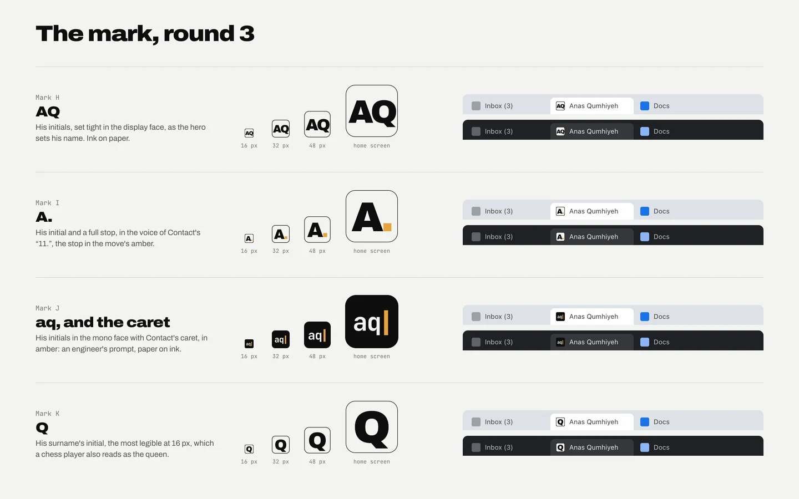

- **H. AQ:** the initials set tight in the display face, as the hero sets his name.
- **I. A.:** the initial and a full stop, in the voice of Contact's "11.", the stop in the move's amber.
- **J. aq, and the caret:** the initials in the mono face with Contact's caret in amber: an engineer's prompt.
- **K. Q:** the surname's initial, the most legible at 16 px, which a chess player also reads as the queen.

## Round 4: J, tied to the theme

The owner likes J: "I like J but it's not relating to the theme of the site, it's just a regular sleek favicon for my name". So J stays, with one tie to the theme. The site's seam is an engine's evaluation bar (White's share rising from the bottom), so the prompt's caret becomes that bar, split at the hero's 55.9%.

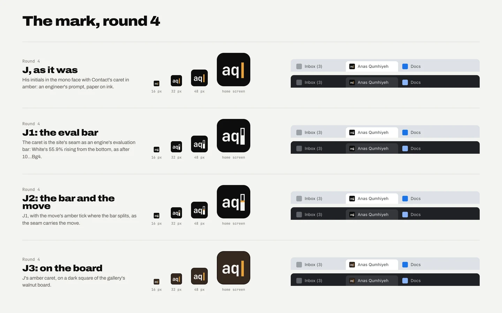

- **J, as it was:** the initials in the mono face with Contact's amber caret.
- **J1, the eval bar:** the caret is the evaluation bar, drawn as a gauge, White's 55.9% filled from the bottom.
- **J2, the bar and the move:** J1 with the move's amber mark where the bar splits.
- **J3, on the board:** J's amber caret on a dark square of the gallery's walnut board.

## Built: the favicon (J1) and the share cards

The owner picked J1. The favicon is built from it, and each page now has its own card.

### The favicon

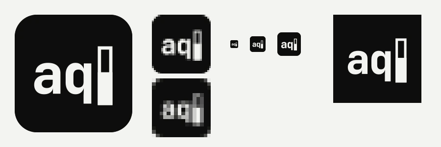

- Left to right: the SVG at 240 px; the 32 px and 16 px images enlarged; 16, 32 and 48 px at true size; the 180 px home-screen icon.
- The browser gets `icon.svg`, with `favicon.ico` (16 and 32 px) for browsers that do not take SVG. Phones get `apple-icon.png`.
- The letters are outlines of JetBrains Mono 700, so the icon looks the same without the font.
- The home-screen icon is square and full bleed, because the phone rounds its own corners.

### The share cards

Each is the page at rest, captured from the site, with "anasqumhiyeh.dev" top right. The résumé uses the home card.

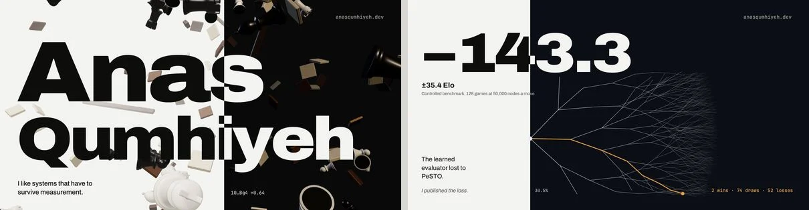

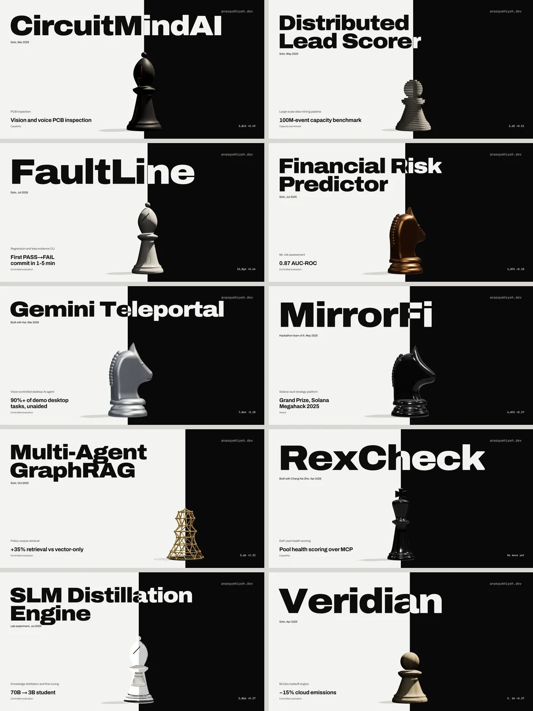

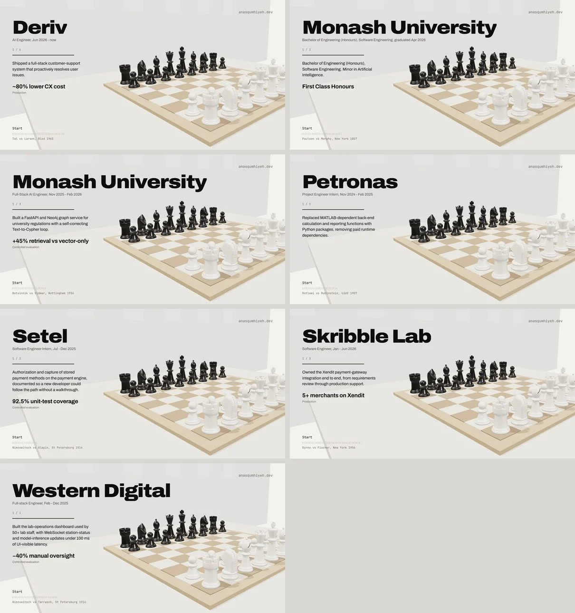

As a link preview:

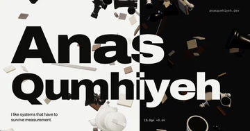 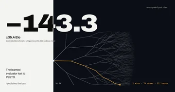 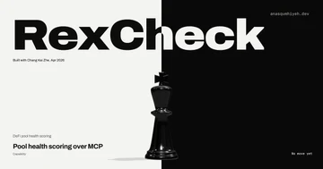 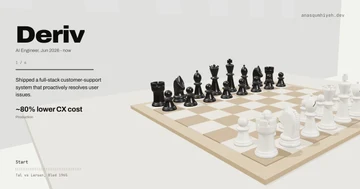

- Project pages are laid out for taller screens. Captured at the card's shape, their piece ran into the name, so on the card the piece stands lower, at the foot, and is shrunk only as far as it takes to clear the name (86 to 98% on six of the ten).
- The cards are remade with `node scripts/cards.mjs` against a running site, after any change to a page's first screen.

### Project cards: a comparison

The owner asked to see the choice behind question 3. Each row is one project page. Column 1 is the page on a laptop, column 2 a straight capture at the card's shape, column 3 the card as built.

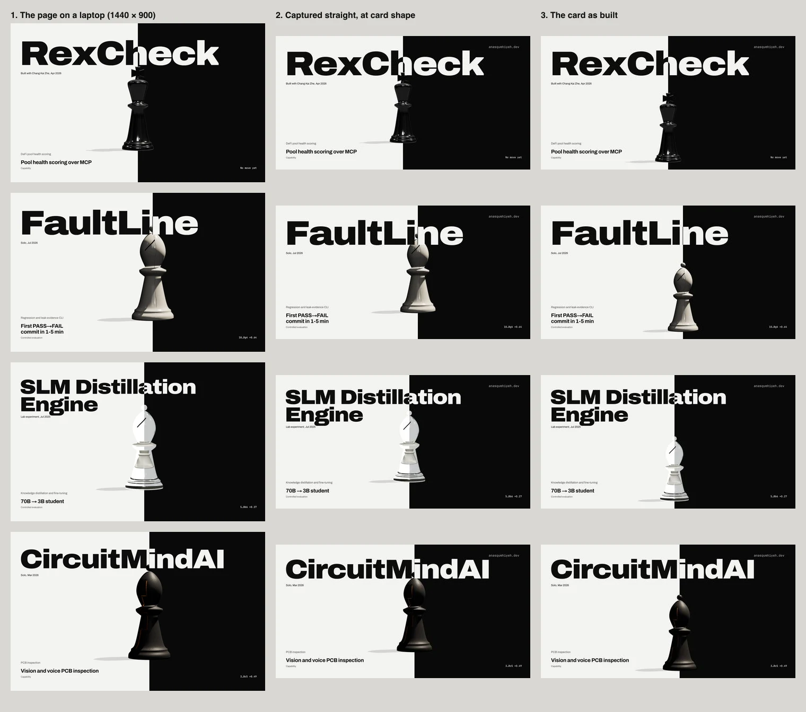

- On the laptop the piece already rises into the name: the king's cross in "RexCheck", the bishop's tip in "FaultLine" and "CircuitMindAI". That is the page's own composition.
- The straight capture (2) keeps it, as the page does.
- The built card (3) lowers the piece and shrinks it a little, so it stands clear of the name. The card then looks different from the page.
