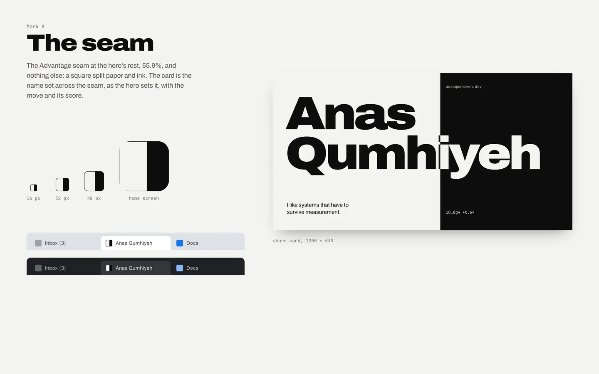
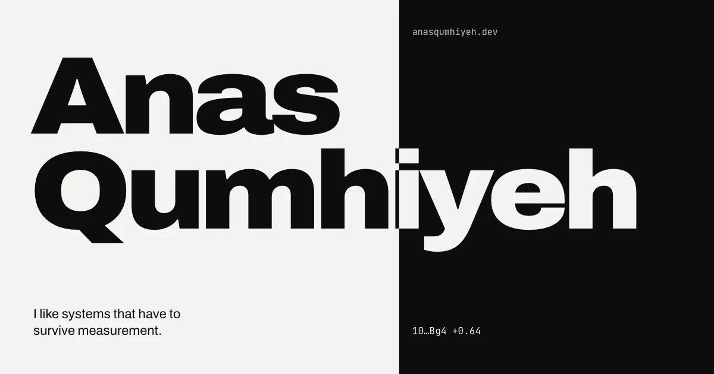
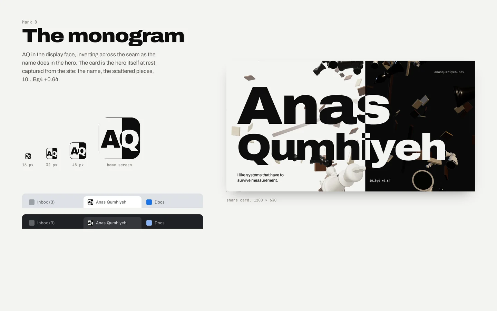
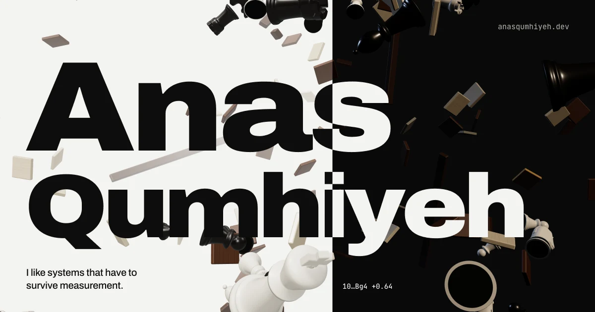
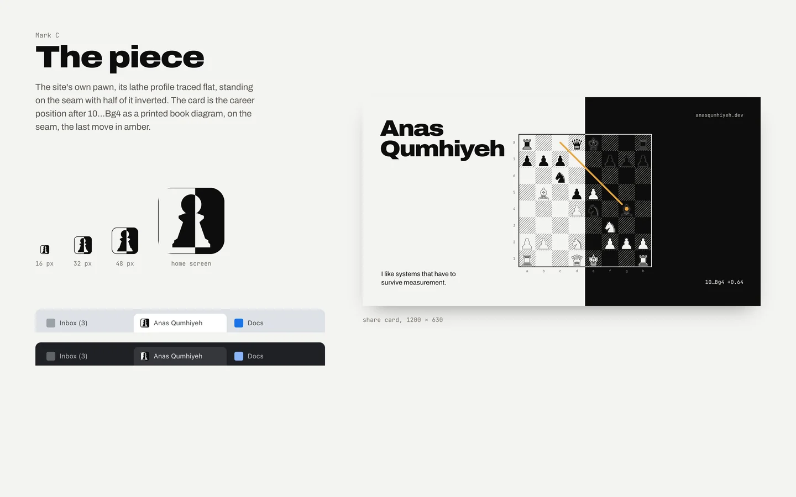
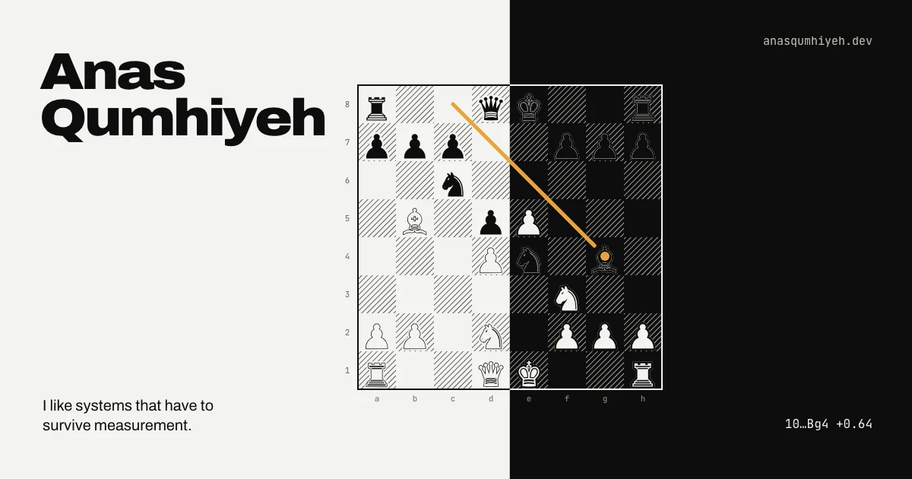
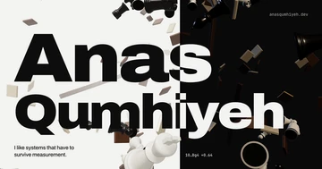
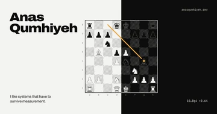
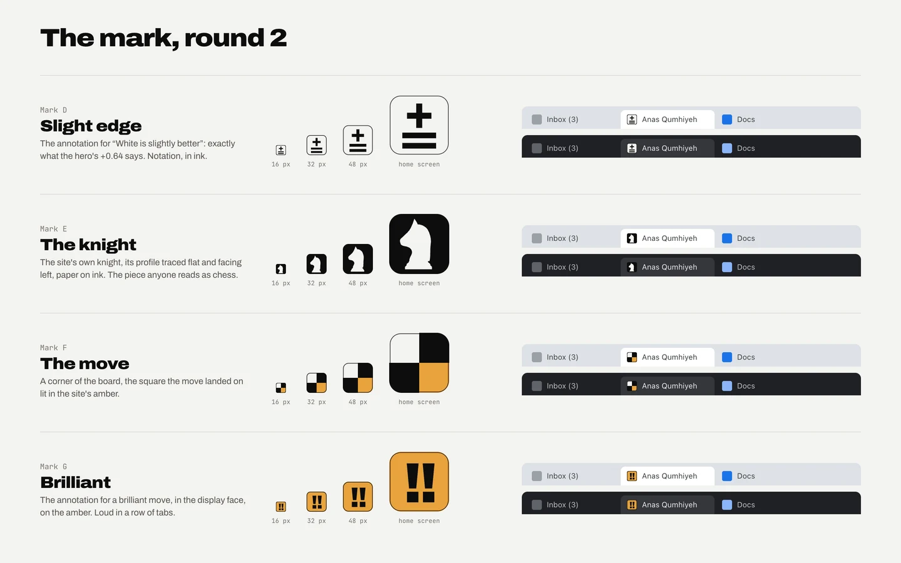

# Phase 6, step 3: the mark and the share card

The site has no favicon and no share card yet. Here are three directions, each a favicon and the card that goes with it. The questions are in the review doc.

Each sheet shows the favicon at the sizes a browser uses (16, 32 and 48 px), the home-screen icon, and the favicon in a light and a dark tab strip beside two other sites' tabs. The card is the image a link shows when it is shared (1200 × 630). Everything sits on the hero's seam, at 55.9%.

## A. The seam

The seam at 55.9% and nothing else: a square split paper and ink. The card is the name set across the seam as the hero sets it, with the tagline, the move and its score. It has no 3D, so the card is sharp at any size and quick to make for every page.

## B. The monogram

AQ in the display face, inverting across the seam as the name does. The card is the hero itself at rest, captured from the site: the name, the scattered pieces, 10…Bg4 +0.64. At 16 px the letters are close to unreadable.

## C. The piece

The site's own pawn, its lathe profile traced flat, standing on the seam with half of it inverted. The card is the career position after 10…Bg4 as a printed book diagram, on the seam, with the last move in amber. Each piece keeps its own colour on both sides of the seam, so the position reads correctly to a chess player.

## As a link preview

This is roughly the size a card appears at in a chat app.

  

## Notes

- The favicon ships as an SVG, with PNG fallbacks at 32 px and 180 px (the home screen). Mark B's letters would be converted to outlines, so the icon does not depend on the web font.
- The card's copy is the hero's own: the name, "I like systems that have to survive measurement." and "10…Bg4 +0.64". "anasqumhiyeh.dev" is new on the card.
- Card C's pieces are the system's chess symbols. For the real card I would draw them from the site's piece shapes instead, so they look the same on any machine.

## Round 2: the favicon

The owner turned down A, B and C for the favicon ("I don't like your designs") and picked card B, the hero, with one card per page. All three were the same idea, a square split by the seam, so round 2 leaves the seam out and tries four different things.

- **D. Slight edge:** ⩲, the annotation for "White is slightly better", which is exactly what the hero's +0.64 says.
- **E. The knight:** the site's own knight, its profile traced flat and facing left, paper on ink.
- **F. The move:** a corner of the board, with the square the move landed on lit in the site's amber.
- **G. Brilliant:** !!, the annotation for a brilliant move, in the display face on the amber.
