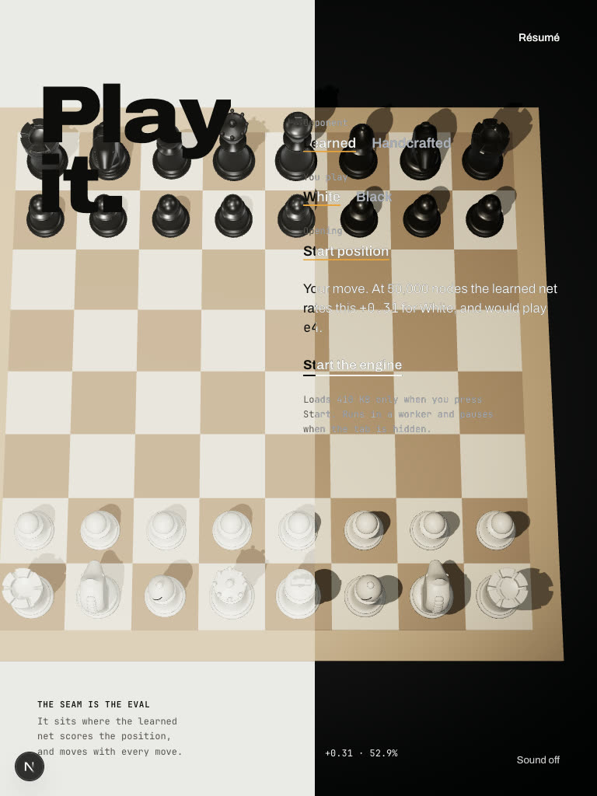
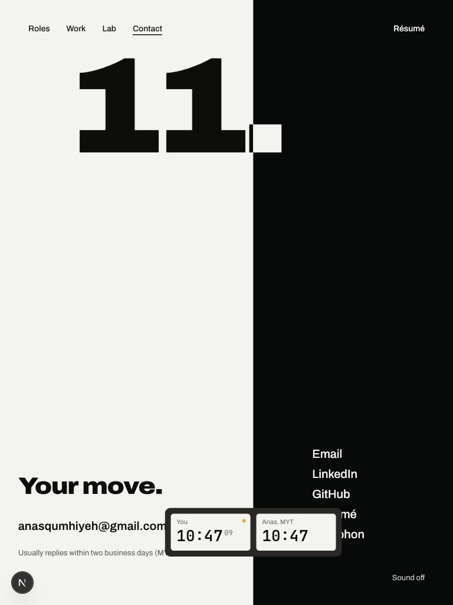
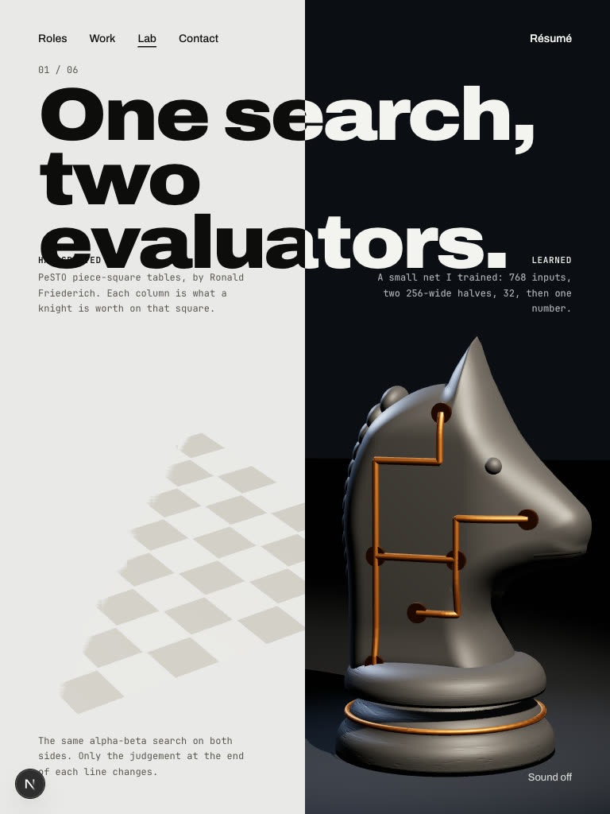
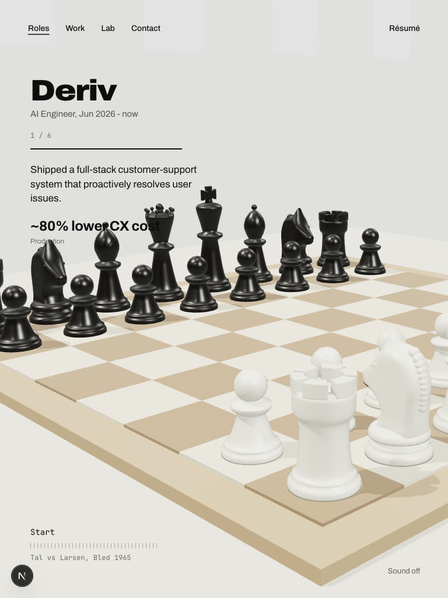
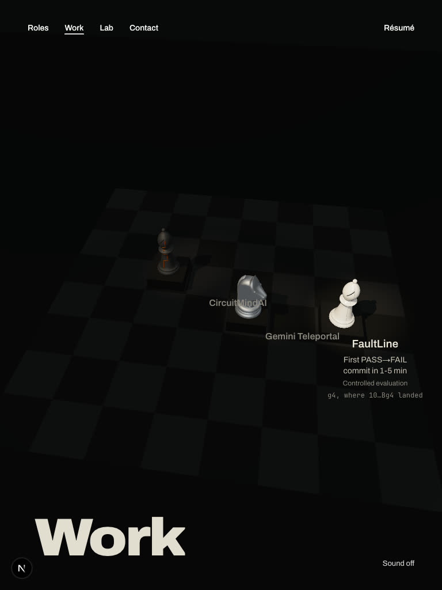

# Narrow desktop and tablet sizes (2026-10-02)

The brief designs two sizes: desktop at 1440 × 900 and phone at 390 × 844. Between 601 and about 1200 px nothing was
designed; there the desktop composition is used. Every page and section at 1024 × 768 (iPad landscape, small laptops)
and 768 × 1024 (iPad portrait): `narrow/sv-1024.jpg`, `narrow/sv-768.jpg`. No page scrolls sideways at either size.

Fine from 1280 × 800 up. Broken:

| | 1024 × 768 | 768 × 1024 |
|---|---|---|
| Play: the board runs into the title and the controls |  |  |
| Contact: the links run into the clock |  |  |
| Lab 01 and 04: the big numbers are cut off at the right | fine |  |
| A role page: the board covers the claim ("~80% lower CX cost") | fine |  |
| Work: the gallery sits small at the top of a tall screen | fine |  |
