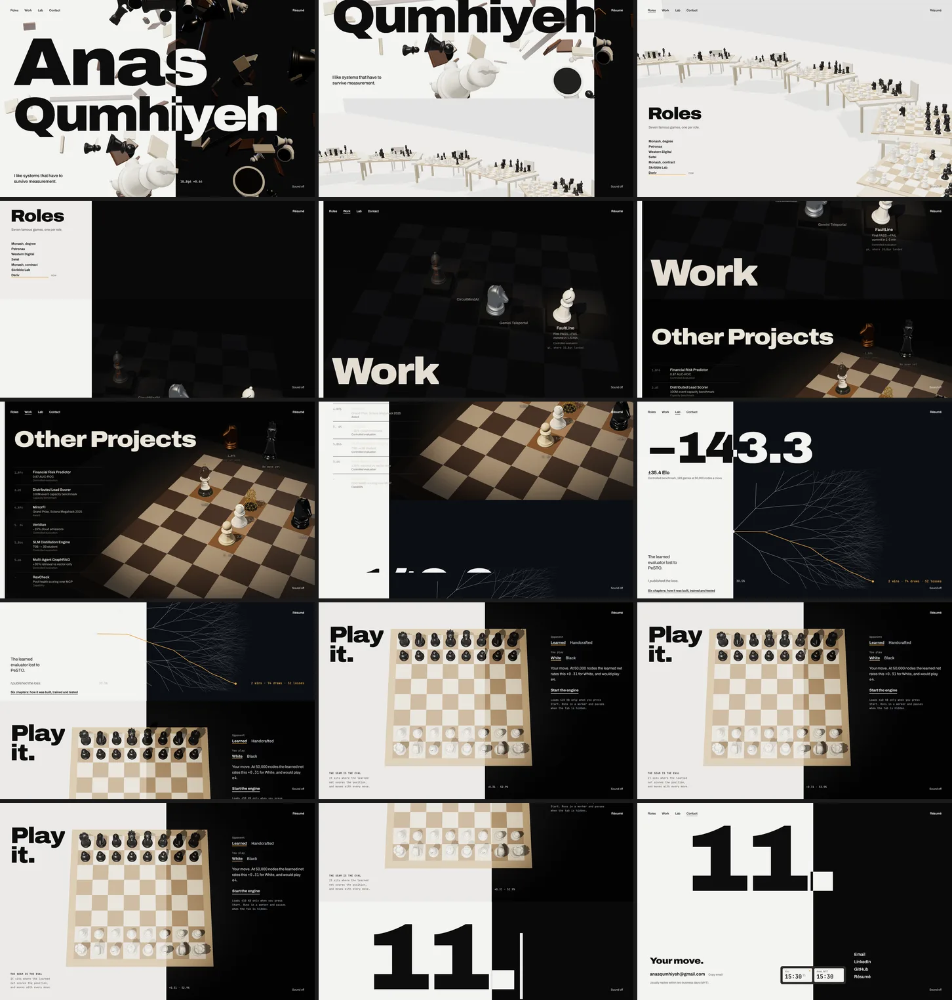
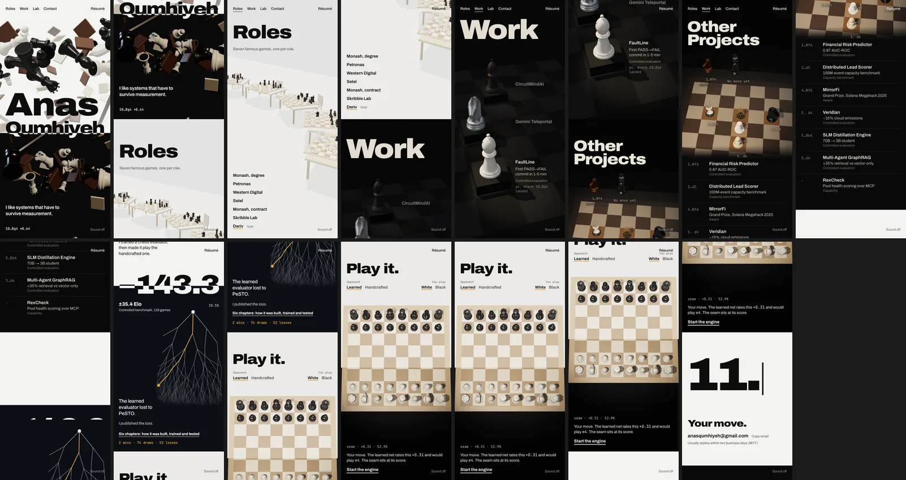
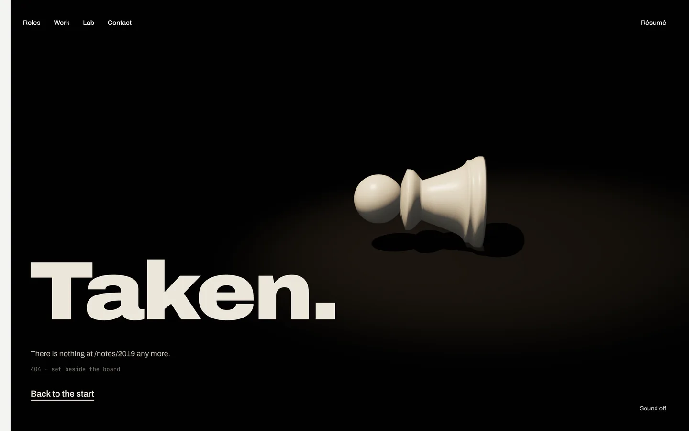
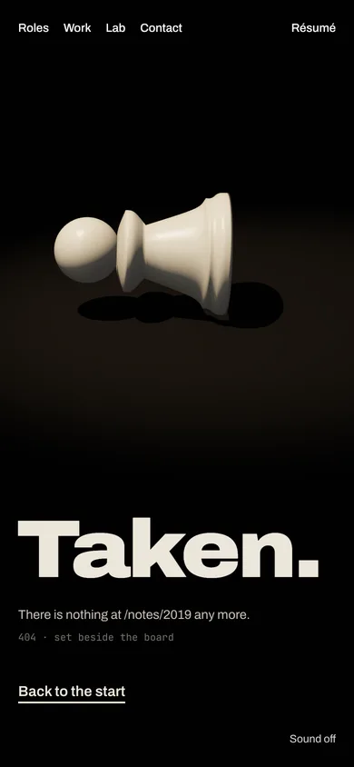

# One page, the 404, and Play's board

Built from the owner's direction (2026-09-29) and the step 5 answers. The questions are in the review doc.

## One scrolling page (commits fc81dd8, ce51e1d, 51c59c6)

Hero, Roles, Work and Other Projects, the Lab's opening and Play, then Contact, on `/`. The nav glides to each section; scrolling gets there too.

- **The seam follows the scroll.** On desktop it is one line, eased from one section's resting place to the next as the boundary crosses the middle of the screen: 55.9% → 100% → 1.5% → 30.5% → Play's eval → 55.9%. On phones each section carries its own split, so the black bands scroll with their sections.
- **The address follows the section in view:** `/#roles`, `/#work`, `/#lab`, `/#contact`. The old `/roles`, `/work` and `/contact` open on their sections. `/lab` is still the whole Lab, and the Lab section links to it: "Six chapters: how it was built, trained and tested".
- **Project and role pages** still sweep in. Back, and their back links, return to the same place on the page.
- **Each section makes its entrance the first time it is seen.** The hero's opening plays only at the top of the page, on a first visit, and holds the scroll while it plays.
- **The nav steps away while the page scrolls down** under it, so titles never run into it, and comes back on the way up, when you land on a section, and on keyboard focus. The résumé link never moves.
- Seven 3D canvases in all; the hall and the gallery are built only when they come near.

Desktop, a frame every half screen from the top:

Phone, a frame every half screen:

## The 404: Taken (commit 319704a)

## Play's board (commit 6e720fa)

After the engine moved, the board ignored clicks for 2 to 3 seconds while a second search ran. The engine's own search already scores the position and names your best reply, so the board is yours the moment its move lands.

## Checks

71 of 71 end-to-end and 70 of 70 unit tests, lint and types pass. axe finds nothing on the page. No sideways scrolling at 1440, 390 or 320 px.
