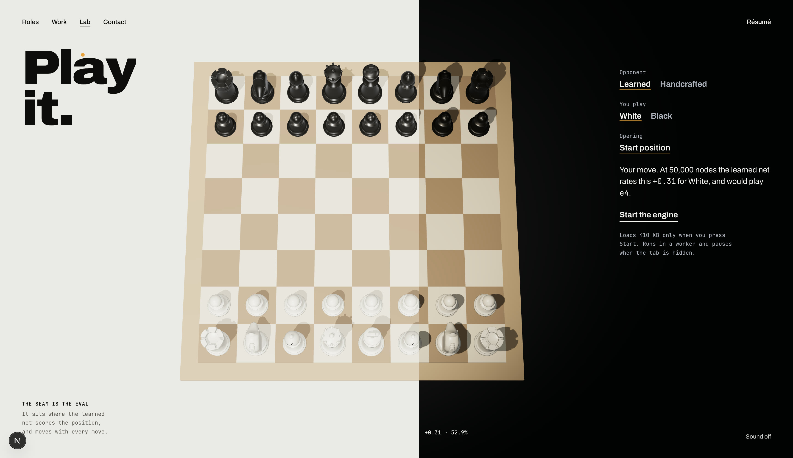
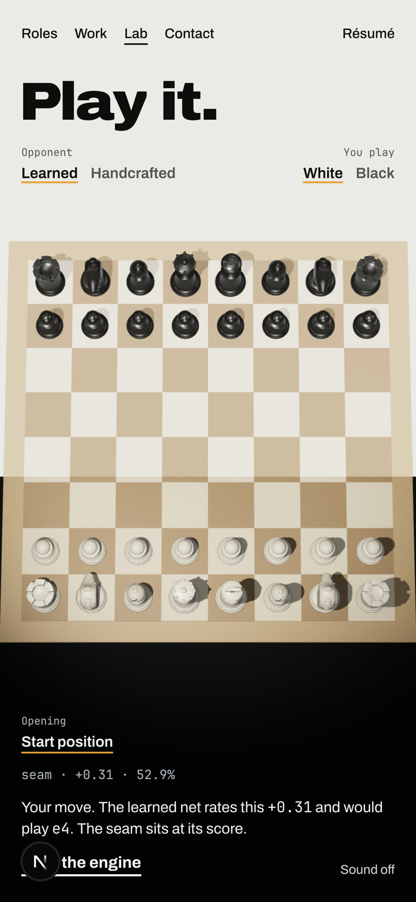
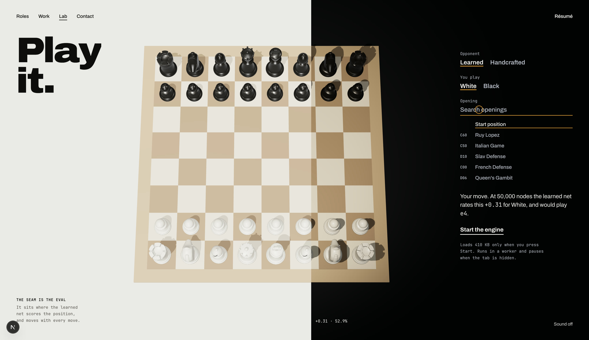
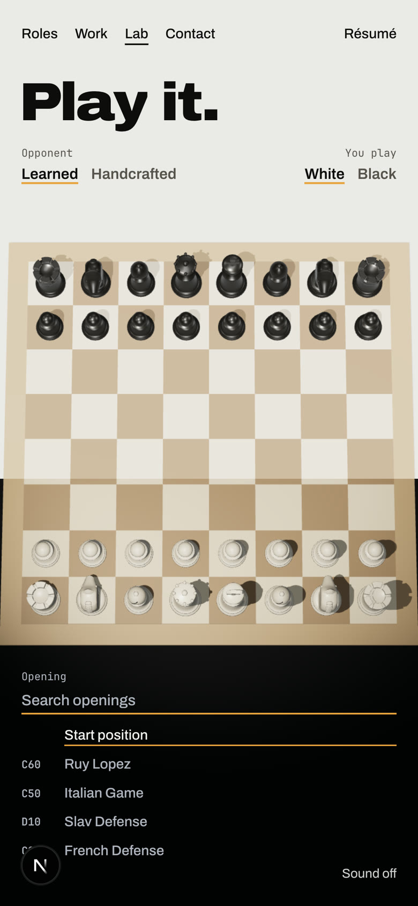
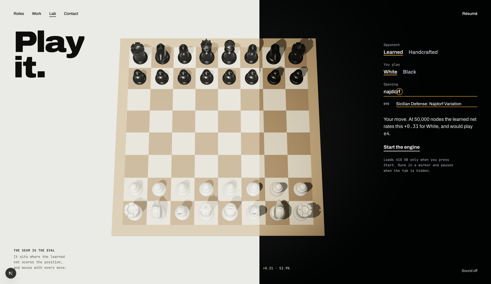
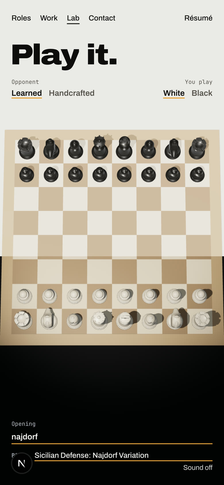
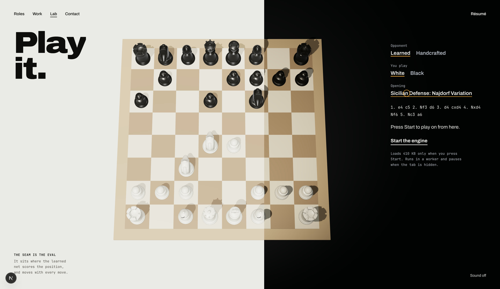
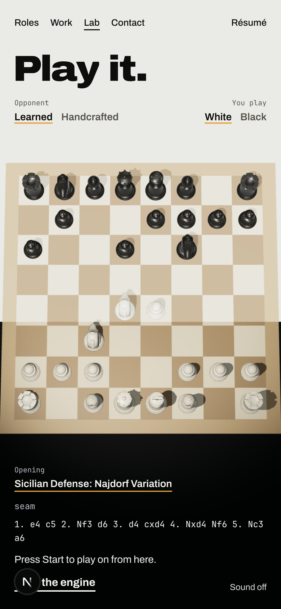
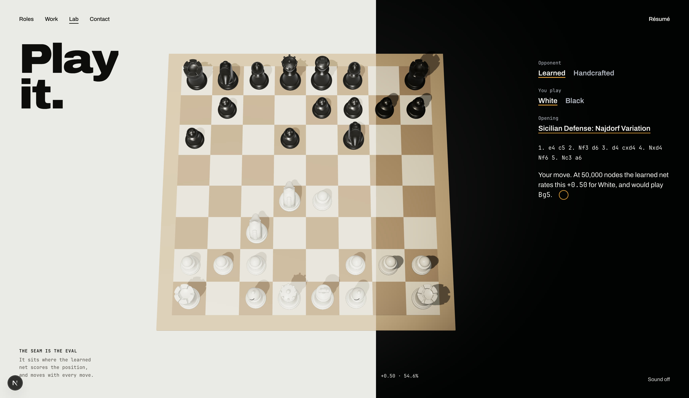
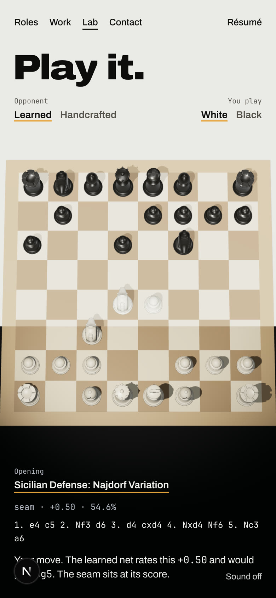

# Play: choosing an opening (comp, built)

The owner's call (2026-10-01): every named opening, searchable. Built in Play itself, on a sample of 10 openings until
the full list (Lichess, CC0, 389 KB as five files) is approved for download. Screens at 1728 × 1000 and 390 × 844.

| | Desktop | Phone |
|---|---|---|
| Closed: "Opening", the start position |  |  |
| Open: the field, the start position and the first matches |  |  |
| Typed "najdorf" |  |  |
| Picked: the pieces slide to it, its moves in the moves line |  |  |
| Start pressed: the engine scores the position and names your move |  |  |

- **Where:** under "You play" on desktop; on phones, above the moves at the foot, since the top row has no room. While
  searching on a phone, the moves, status and Start step aside so the matches stay clear of the board (five shown).
- **Search:** every word typed must be in the name, or be the ECO code; the shortest names come first, so "sicilian"
  finds the Sicilian Defense before its variations. Arrow keys move through the matches, Enter picks, Escape closes.
- **The game:** it goes on from the opening's position; if the engine is to move, it moves first once started. The
  repetition and fifty-move counts include the opening's moves.
- **Before Start**, the seam and its score stay where they were and the score's label is hidden, since only the
  learned net (loaded on Start) can score the position. The alternative, asked at the gate: score every opening ahead
  of time, so the seam moves the moment one is picked.
- **New copy (asked at the gate):** "Opening", "Start position", "Search openings", "No opening by that name.",
  "Press Start to play on from here.", "The {net} net moves next. Press Start."
