# Gate 5, step 4a: Other Projects, built

You picked comp A. The seven other projects are now on the walnut board, below the featured three on /work (`/work#archive`, where the old /archive lands). The section is titled "Other Projects", and each project opens its own page. Stills are from the dev build at 2×.

The questions are in the review doc.

## The board at rest, and while a row is read

Reading a row, by hover or focus, lifts its piece into its own light, and the lamp eases down a little. The tags come up with the lamp as the board scrolls into view.

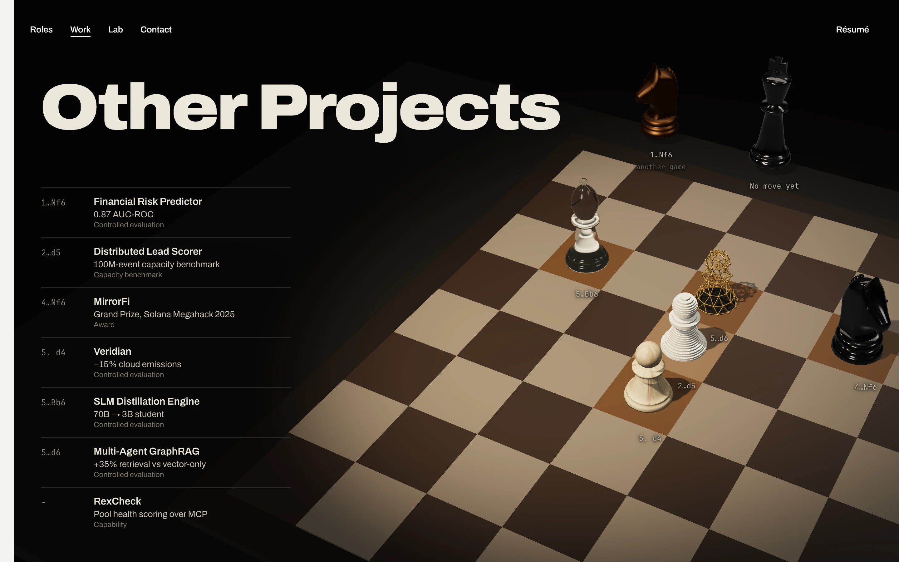
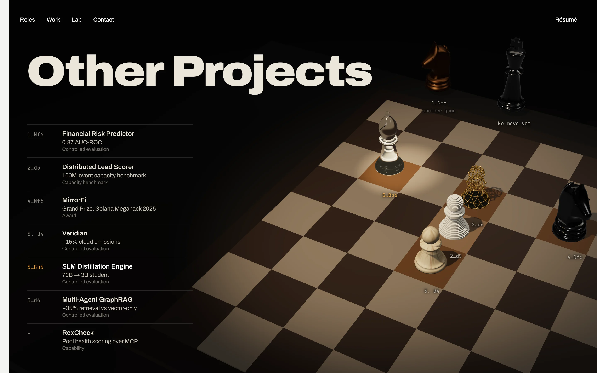

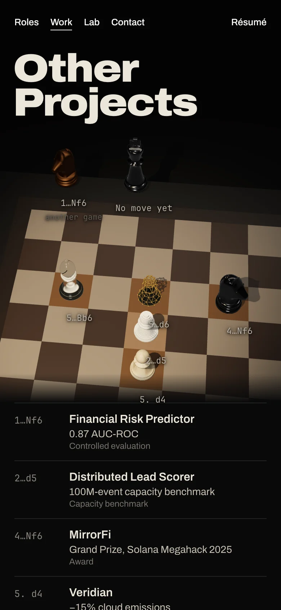 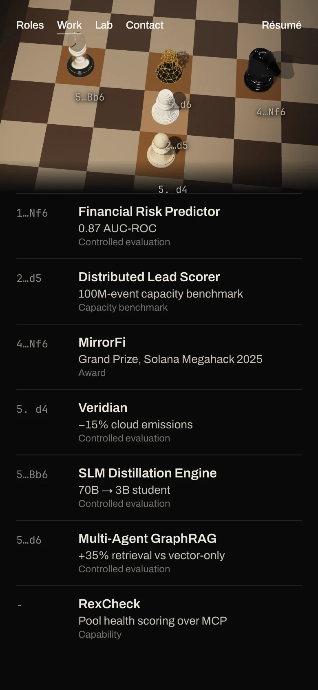

## Opening one: MirrorFi

The camera steps down to the knight while the rest of the set fades and the type leaves. The knight turns to its page's angle, and the page is cut in on landing, as from the gallery. The frames are from 0 to 3.6 s.

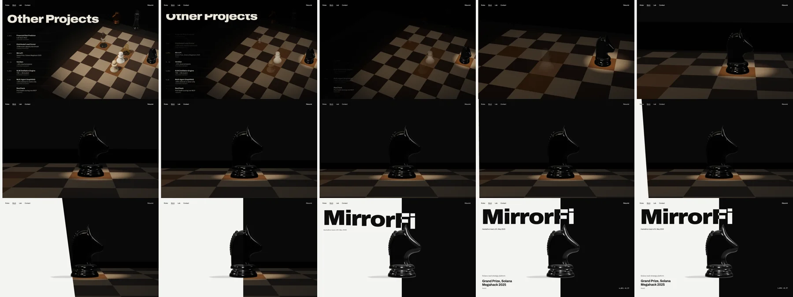

## The seven pages

Each page rests its seam at its own move's eval. RexCheck has no move, so its page rests level, at 50%.

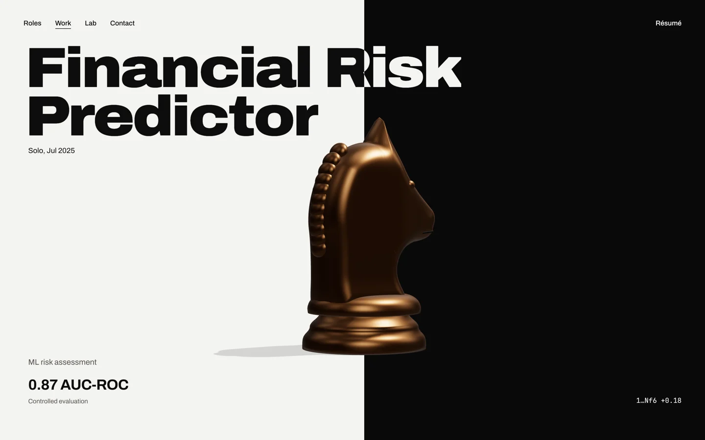
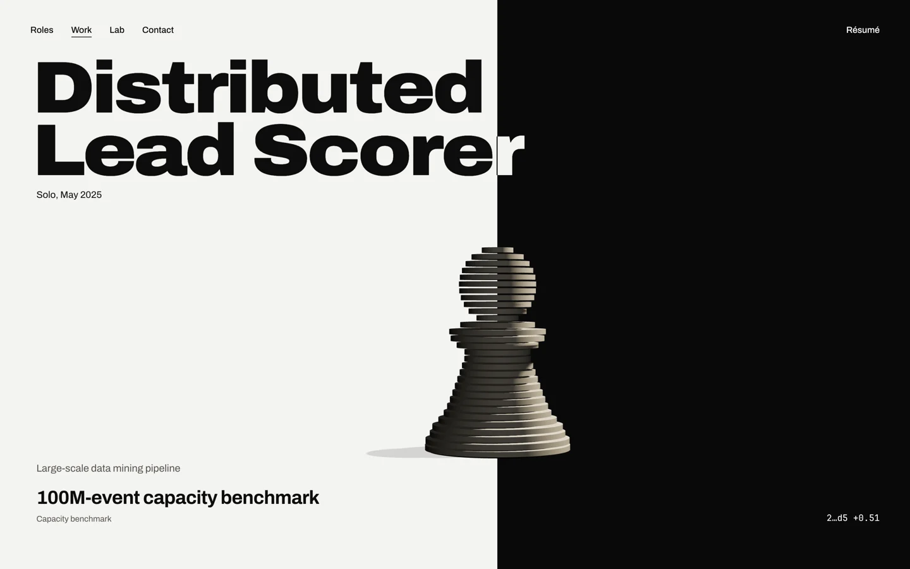
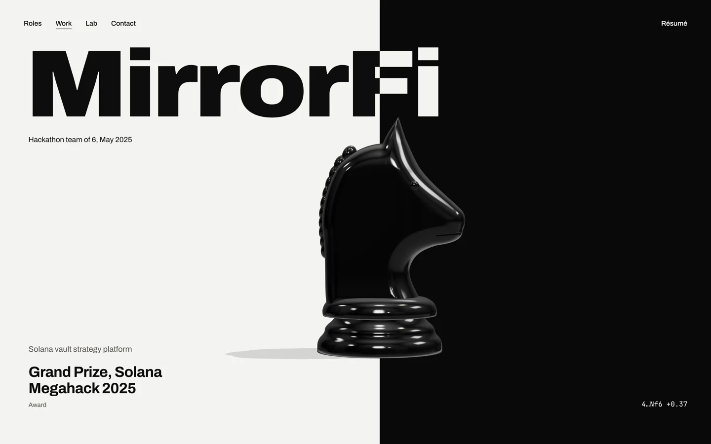
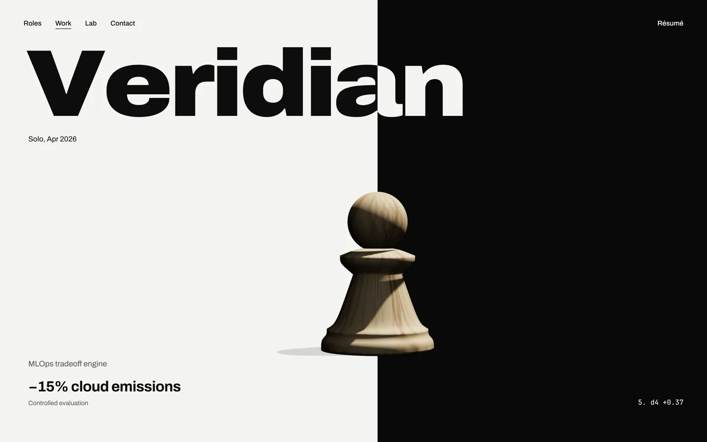
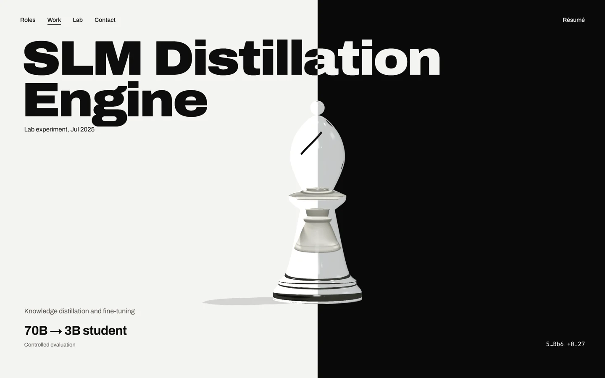
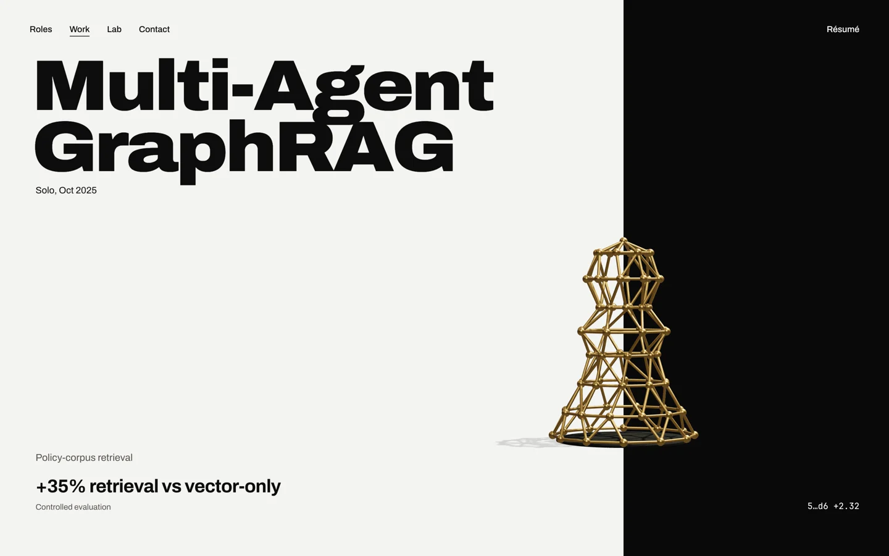
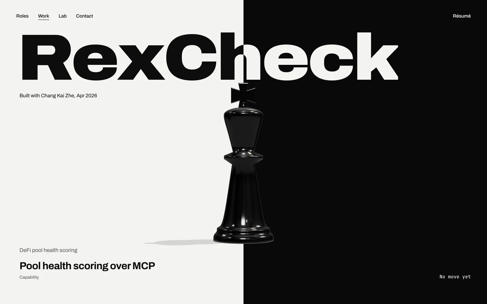

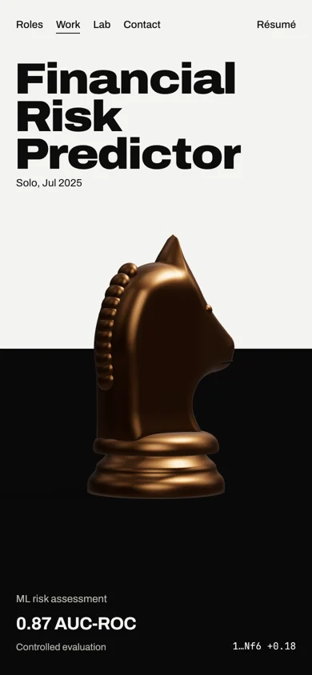 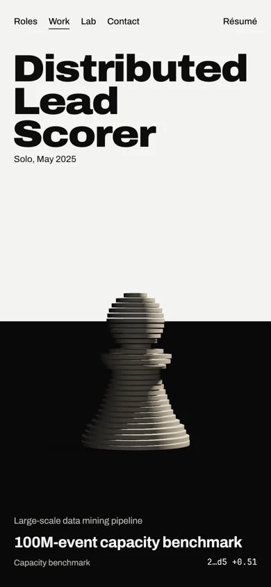 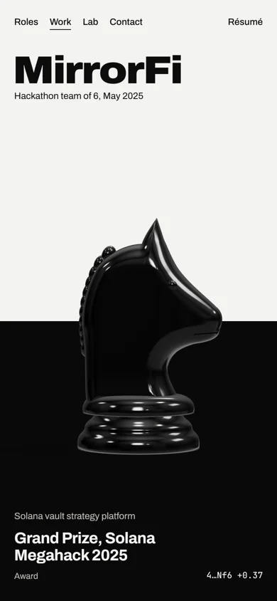 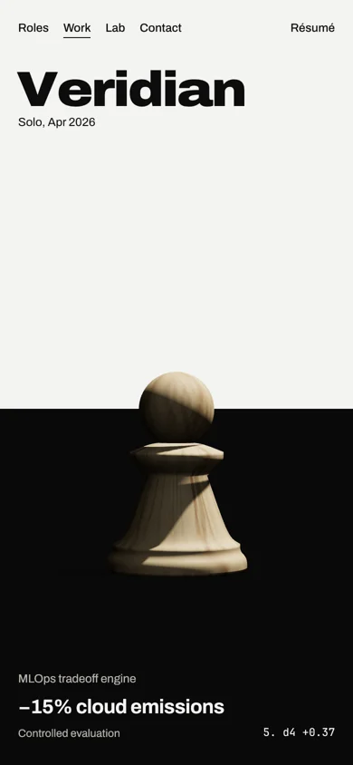 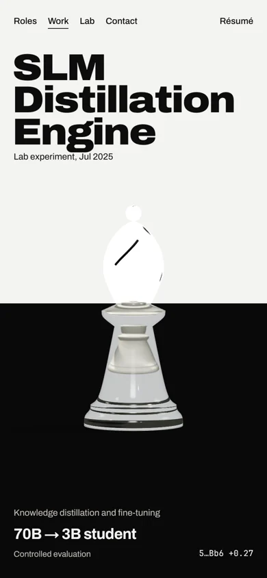 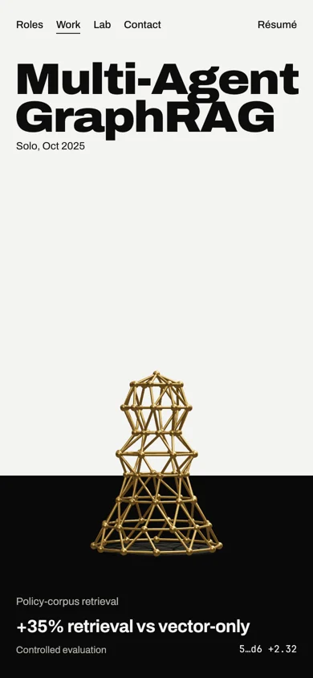 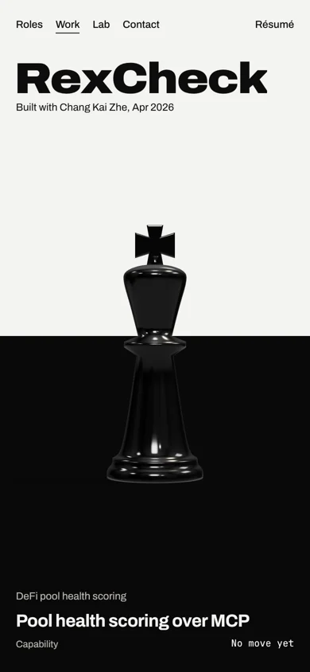

## The case study

The case study shows only the sections each project has in content.json. None of the seven has a cover or screenshots yet.

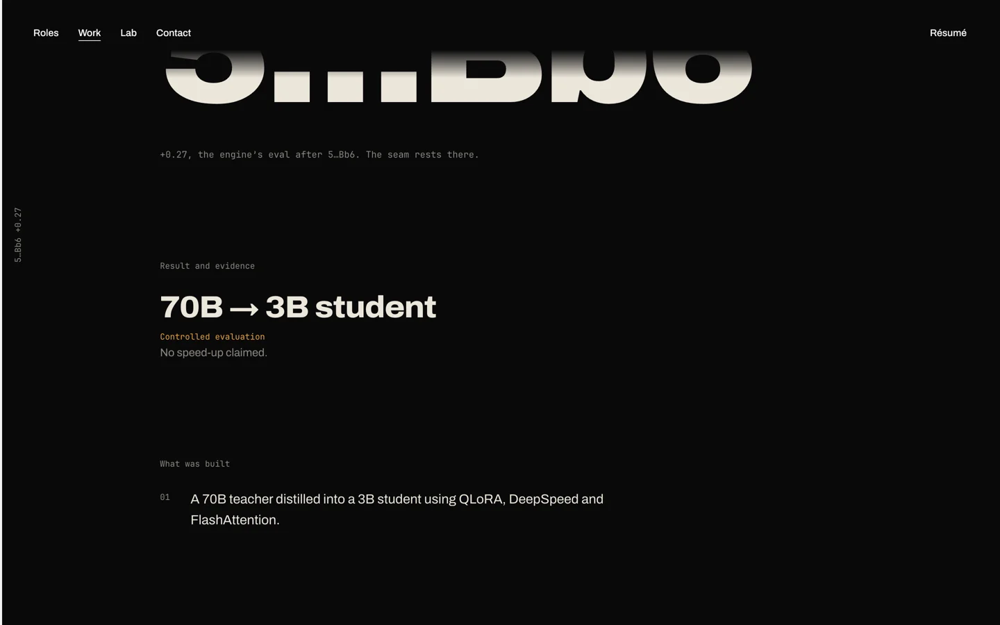

## Checks

- Every page was checked at 1440, 390 and 320 px: no sideways scrolling, and no text clashing with a piece.
- Tests: all 38 end-to-end tests pass, including new ones for the scoresheet, its order, /archive, accessibility and the reduced-motion cut. All 64 unit tests pass.
- The production build passes.
