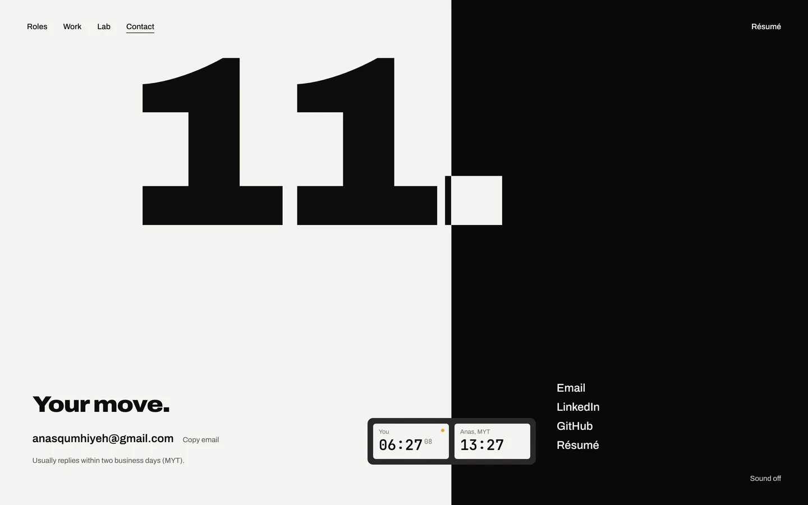
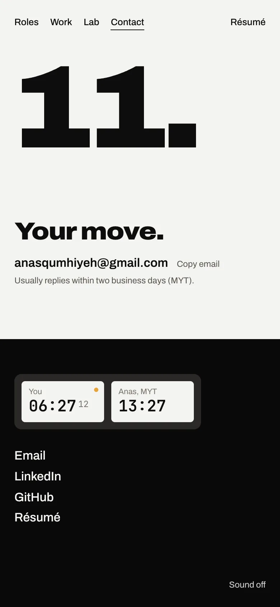
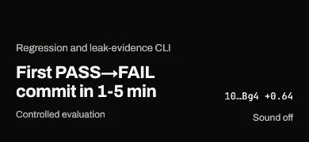
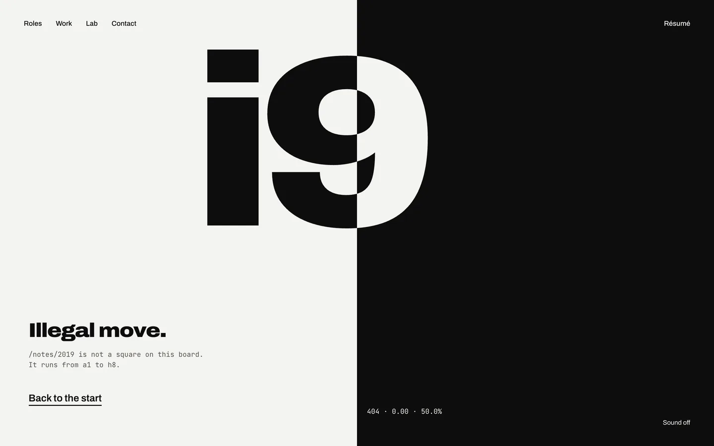
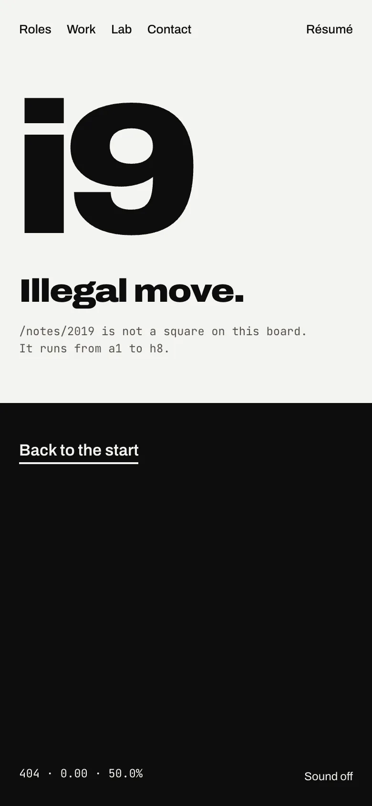
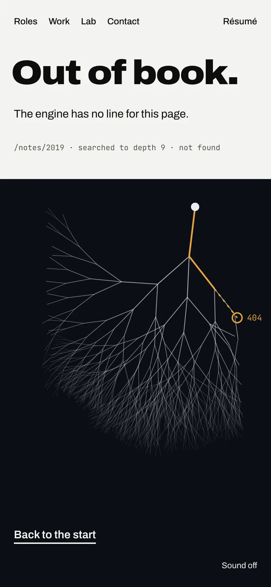
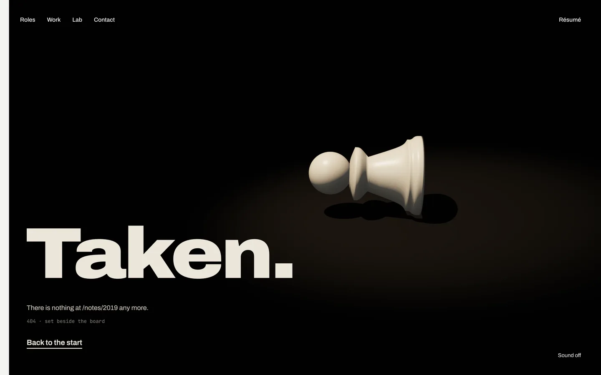
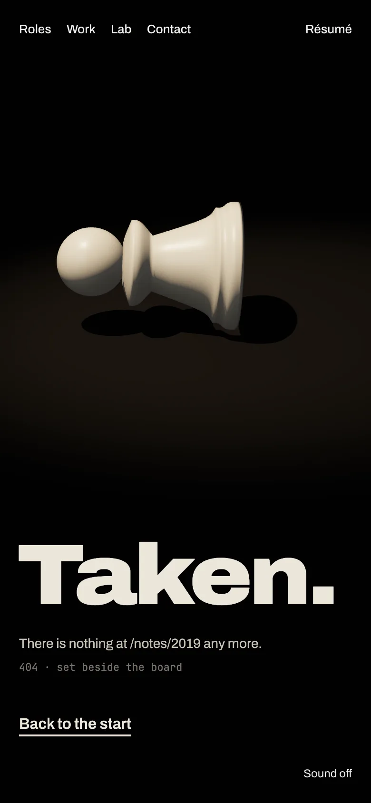

# Gate 5, step 5: sound, the loader and the 404

Step 5 is the loader, the sound toggle and the 404 page. Sound is built. The loader needs one decision. The 404 has no key frame yet, so here are three comps to choose from. The questions are in the review doc.

## Sound (built, commit f433001)

"Sound off" sits in the bottom-right corner of every page, in ink and in paper across the seam like the nav. It is off by default and remembered once turned on. The four cues (51 KB) are fetched only when you turn it on:

- **seam:** a felt swish under each sweep (a reduced-motion cut is silent)
- **place:** a set-down for each move, in the hero's game, a role page's replay and Play
- **break:** the hero's blast
- **tick:** one quiet tick a second on Contact (none under reduced motion, where the clock moves by the minute)

Two labels moved one line up on phones to clear the toggle: a project page's eval label, and the Lab's "35,405,130 read" line in chapter 2. On a project page:

## The loader

The storyboard's loader is the first 0.7 s of the hero: the board lit in the spot while fonts load (it holds there until they are in, and goes on by 2.5 s regardless), with the skip link live. That is built. The storyboard also says it plays on the first visit to *any* page; today a first visit straight to /work or /lab has no loader, and the page makes its usual entrance. See the question in the doc.

## The 404: three comps

Each keeps the site's language: the seam at a score, the nav, the résumé link and the sound toggle. The copy is new, and the address shown is an example.

### A. Illegal move

The seam is level (0.00, 50%): there is nothing to play for. "i9" is a square the board does not have, and it inverts across the seam like the name.

### B. Out of book

The Lab's seam and search tree. The line you asked for is amber for five moves, then dashes into nothing and stops on an empty ring marked 404.

### C. Taken

The gallery, all black but Work's paper edge. One captured pawn lies on its side under a spot, set beside the board.

