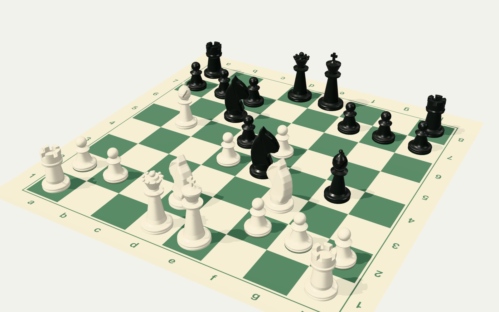
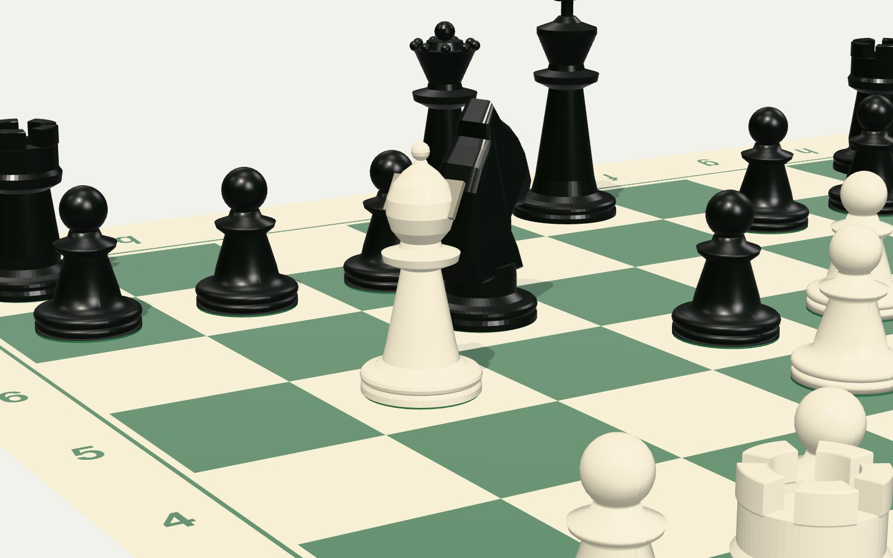
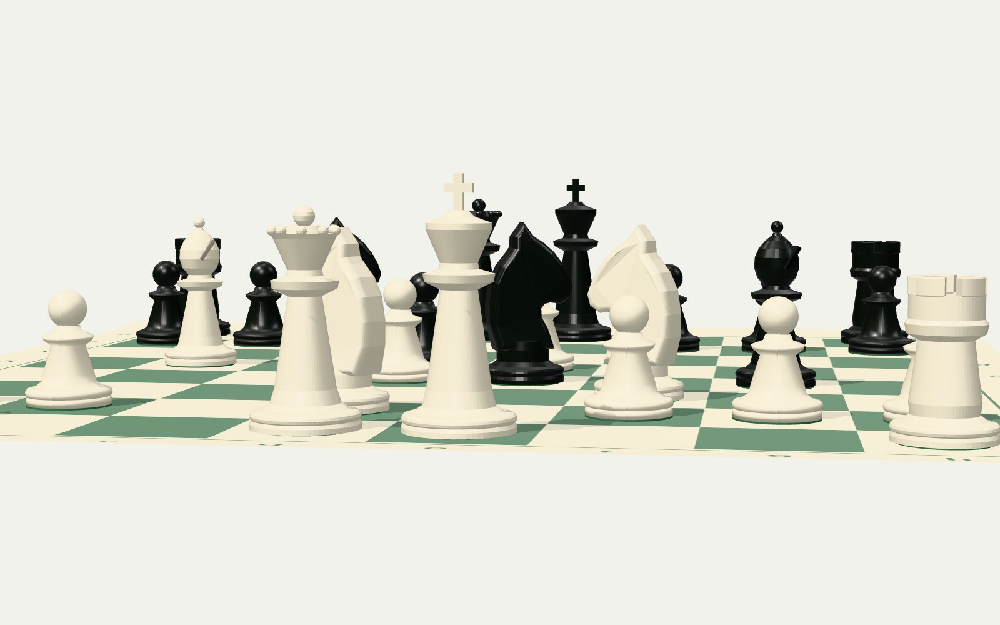
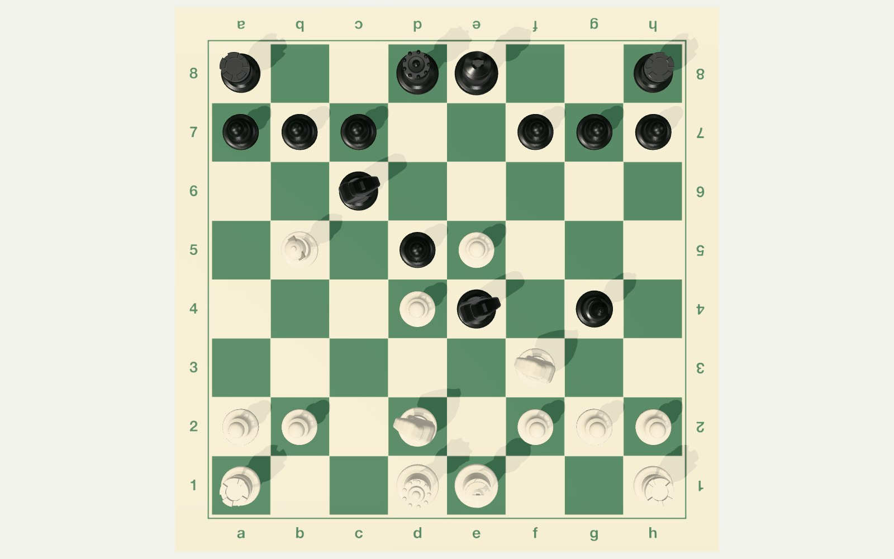
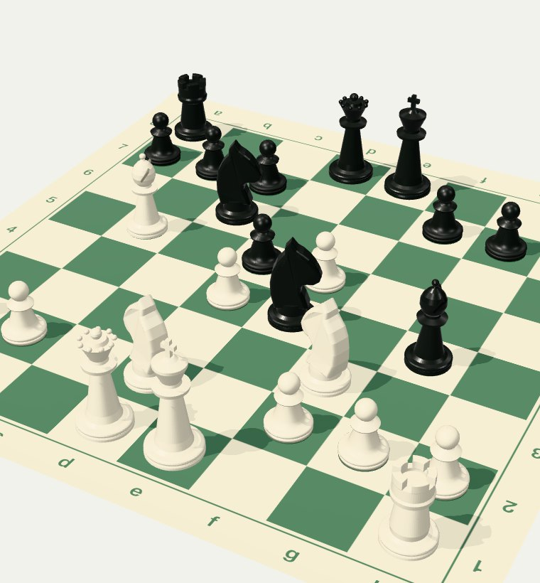
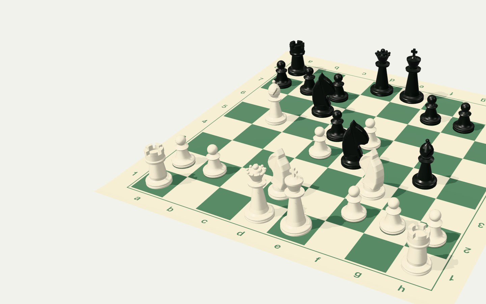
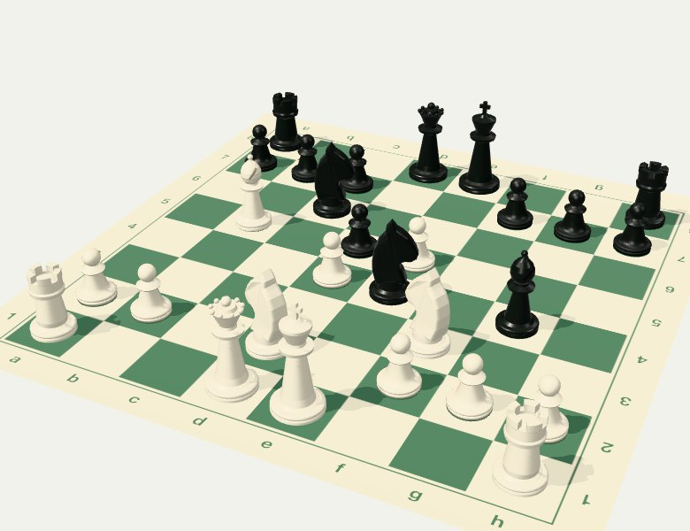
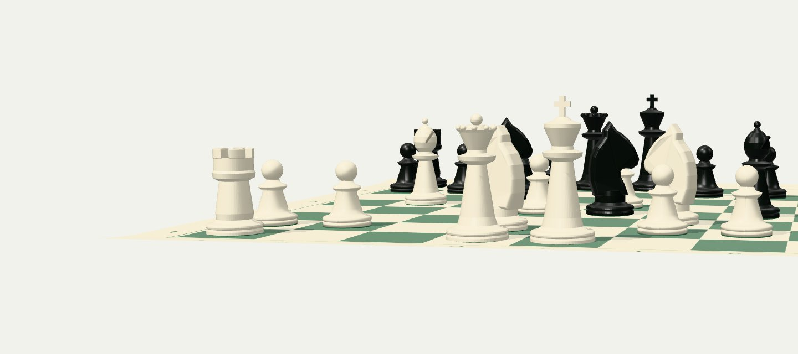

# Phase 1: visual system (Review gate A)

Status: **gate A passed on the owner's standing instruction** (2026-09-27: "go with the recommended choice; you have consent for the next phase"). Every choice below is the recommendation.

Design read: *a redesign of a developer portfolio for hiring managers and engineers skimming on work laptops. It uses the language of a club tournament analysis board and a printed games book, built on Tailwind v4 tokens, one React Three Fiber board, and GSAP motion that feels weighted.*

Dials (`design-taste-frontend`):
- **VARIANCE 6.** An offset split, with the board bleeding off the right edge.
- **MOTION 5.** All the boldness goes into the board; everything else stays quiet.
- **DENSITY 4.** Recruiters skim, but the proof has to fit in one screen.

Skill conflicts, settled for the briefs as `.claude/skills/README.md` requires:
- Em dashes stay in canonical copy.
- The site stays light-only, so there is no dark mode and no board-flip theme change.
- The chess cursor is allowed by brief §4.

## 1. Board material: tournament vinyl roll-up mat, club plastic Staunton pieces

| | |
|---|---|
|  |  |
| Current position, 10…Bg4, White to move | Material detail: satin plastic, felt pads, printed coordinates |
|  |  |
| Low raking angle for the contact ending | Top-down check that the position matches `GAME` (FEN `r2qk2r/ppp2ppp/2n5/1B1pP3/3Pn1b1/5N2/PP1N1PPP/R2QK2R`) |

**Why this material** (governing question: *what would this look like on a tournament analysis board?*):
- It is the board in every tournament analysis room and chess club: green and buff calendered vinyl, rolled up in a tube.
- It feels personal rather than luxurious. That meets PX PUSH's bar ("personal flavoured, not corporate").
- Algebraic coordinates are **printed on the mat itself**, so the notation is part of the object.
- The pieces are weighted club plastic with green felt pads.
- Plastic needs no textures, so the whole set fits the §8 asset budget with room to spare. The Phase 1 pieces are lathe-turned geometry generated in code and weigh nothing to download.

**Rejected:**
- *Turned wood* is the default for luxury chess, and it needs large albedo, roughness and normal textures.
- *Lacquer* is decor.
- *Felt* belongs under the pieces, and it is kept there as the pads.

**Mat details:**
- 8 squares plus a printed border 0.62 of a square wide, with coordinates read from both sides.
- Fine pebble grain as a bump map; satin sheen at roughness 0.58 with a light clearcoat.
- The two short ends curl up about 0.05 of a square, the way a rolled mat never quite lies flat.

The render harness (`docs/upgrade/phase-1/render-harness.html`) is a standalone three.js file. Phase 2 ports it to R3F.

**Known limit:** the procedural knight is stylised, an extruded profile with a tapered muzzle and crest. A licensed CC0 model would look better. The owner's standing rule is "no downloads unless asked", so the knight stays procedural, and this is logged as a later option.

## 2. Tokens

### 2.1 Palette (6 named values)

| Token | Hex | Role | Contrast |
|---|---|---|---|
| `paper` | `#F1F2EC` | Page ground. Uncoated book stock in daylight: cool and faintly green, **not cream**. | — |
| `ink` | `#161B19` | Text, primary buttons, black pieces | 15.5:1 on paper |
| `pencil` | `#57605B` | Secondary text, commentary, captions | 5.8:1 on paper |
| `hairline` | `#D2D6CE` | Rules and borders (not text) | — |
| `green` (tournament green) | `#3B6A4B` | **The one accent**: dark squares, links, focus ring, arrows, annotation glyphs | 5.6:1 on paper, 4.8:1 on buff |
| `buff` | `#E8E2C9` | Light squares, square highlights, the scoresheet slip | ink on buff 13.4:1 |

- Two colours are materials, not tokens: ivory plastic `#E7E0CA` and black plastic `#1B1E1C`, used only in 3D.
- Eval bars stay pure black and white (a decision recorded in `AUDIT.md`).

Checked against the brief's bans:
- Not cream + serif + terracotta: the paper is a cool grey-green white, the family is a grotesk, and the accent is green.
- Not near-black + neon.
- Not the `design-taste-frontend` premium-consumer beige/brass family.

How the old tokens map (Tailwind `@theme`, same names where they already exist):

| Old | New |
|---|---|
| `--color-ink` #14181d | `ink` |
| `--color-muted` #4a5561 | `pencil` |
| `--color-rule` #d7dde3 | `hairline` |
| `--color-board-light` #e4e8ec | `buff` |
| `--color-board-dark` #7d8a99 | `green` |
| `--color-annotation` #6d3fd6 | `green` |
| `--color-paper` #ffffff | `paper` |

`themeColor` changes to `paper`.

### 2.2 Type: two families plus a 12-glyph figurine subset

- **Schibsted Grotesk (kept)** for everything, notation included.
  - The shipped subset already has `tnum`, a real ellipsis (U+2026) and a true minus sign (U+2212), confirmed with fontTools.
  - Moves, evals, dates and figures get `font-variant-numeric: tabular-nums`.
  - Negative evals use U+2212, e.g. −0.18.
  - Weights: 400 and 500, plus **italic 400** for commentary.
- **Commit Mono (kept)** for the engine view, eval readouts, scoresheet columns and the chess clock.
- **Literata is retired.** Commentary moves to Schibsted Grotesk italic, because chess books set commentary in the text face and the skill wants emphasis within one family. "Facts roman, commentary voice" survives as roman versus italic.
- **Noto Sans Symbols 2 chess subset (kept)** for figurines only. It is not a text family.

Scale, unchanged except where noted:
- Display `clamp(2.25rem, 4.6vw, 3.5rem)` / 1.08 / 500.
- Section h2 1.75rem / 1.2 / 500.
- Lead 1.15rem. Body 1rem / 1.6.
- Small 0.875rem. Notation labels 0.875rem / 500 / tabular.

### 2.3 Shape

All sharp, radius 0, with 1 px rules. This matches the board squares and printed pages; the buttons are already square.

### 2.4 Motion: one curve, one duration scale

- **House easing `place`:** `cubic-bezier(0.6, 0, 0.2, 1)`, which is GSAP `CustomEase.create("place", "M0,0 C0.6,0 0.2,1 1,1")`. It lifts without hurry, travels, and takes a long, soft settle: a strong player placing a piece.
- **Duration scale** (×1.5 from 120 ms), exposed as CSS custom properties and one TS module:

| Token | ms | Used for |
|---|---|---|
| `--t-tap` | 120 | Cursor feedback, one ply in the opening replay |
| `--t-hover` | 180 | Hover and focus colour |
| `--t-lift` | 270 | A piece lifting and settling |
| `--t-move` | 400 | One square of travel; a margin annotation sliding 24 px; a title reveal step |
| `--t-reframe` | 600 | Camera reframe; the diagram fading into the 3D board |
| `--t-push` | 900 | One segment of the opening push-in |

- **A move** = lift (`--t-lift`, rise 0.18 of a square) → travel (`--t-move` × path length, `place`) → settle (`--t-lift`).
- **Opening replay:** 20 plies at a 135 ms stagger with 120 ms travel, about 2.9 s in total. The camera push-in runs over the same span.
- **Reduced motion:** every duration becomes 0, positions swap instantly, and the camera does not move.

## 3. Home hero: two wireframes, one recommendation

### Option A: board left, content right

```
1440 ┌──────────────────────────────────────────────────────────────────────┐
     │ Anas Qumhiyeh                         Work   About   Lab   Contact    │
     ├───────────────────────────────────┬──────────────────────────────────┤
     │                                   │                                  │
     │   ┌───────────────────────────┐   │  I like systems that have to     │
     │   │                           │   │  survive measurement.            │
     │   │      3D BOARD  (View)     │   │                                  │
     │   │   low orbit, 10…Bg4,      │   │  Anas Qumhiyeh — AI Engineer at  │
     │   │   White to move           │   │  Deriv. I build production …     │
     │   │                           │   │  AI Engineer at Deriv since …    │
     │   └───────────────────────────┘   │                                  │
     │   10…Bg4  FaultLine        +0.64  │  [ See the work ]  [ Contact ]   │
     ├───────────────────────────────────┴──────────────────────────────────┤
     │  ~80% lower CX cost    CSAT 5/10 → 8/10    ~20,000 complex events/day │
     └──────────────────────────────────────────────────────────────────────┘
 390 ┌────────────────────────┐
     │ Anas Qumhiyeh   Résumé │
     │ Work About Lab Contact │
     │ ┌────────────────────┐ │   The board comes first on phones, so the
     │ │   3D BOARD / diagram│ │   headline drops below the fold on a 390×844
     │ └────────────────────┘ │   screen. It fails "hero fits the viewport".
     │ I like systems that …  │
     └────────────────────────┘
```



### Option B: full-bleed board behind the content column (**recommended**)

```
1440 ┌──────────────────────────────────────────────────────────────────────┐
     │ Anas Qumhiyeh                         Work   About   Lab   Contact    │
     ├──────────────────────────┬───────────────────────────────────────────┤
     │                          │ ░░░░░░  canvas View, full bleed to the    │
     │ I like systems that have │ ░░  right edge; the board is lens-shifted │
     │ to survive measurement.  │ ░░  into the right 2/3, so the text      │
     │                          │ ░░  column always sits on clear paper    │
     │ Anas Qumhiyeh — AI …     │ ░░        ┌─ ─ ─ ─ ─ ─ ─ ─ ─┐            │
     │ AI Engineer at Deriv …   │ ░░        │   3D BOARD      ·            │
     │                          │ ░░        │   10…Bg4        ·   (bleeds  │
     │ [ See the work ][Contact]│ ░░        └─ ─ ─ ─ ─ ─ ─ ─ ─┘    off)    │
     │                          │  10…Bg4 · FaultLine · +0.64               │
     ├──────────────────────────┴───────────────────────────────────────────┤
     │  ~80% lower CX cost    CSAT 5/10 → 8/10    ~20,000 complex events/day │
     └──────────────────────────────────────────────────────────────────────┘
      On scroll, the board docks into the sticky board pane on the right
      (PX PUSH's logo dock, turned into chess).
 390 ┌────────────────────────┐
     │ Anas Qumhiyeh   Résumé │
     │ Work About Lab Contact │
     │ I like systems that    │  Text first: the LCP is text, and the
     │ have to survive …      │  headline and CTAs fit in 844 px.
     │ Anas Qumhiyeh — AI …   │
     │ [See the work][Contact]│
     │ ┌────────────────────┐ │  The board sits below, as a 4:3 box
     │ │ diagram → 3D board │ │  (printed diagram, then 3D when idle).
     │ └────────────────────┘ │
     └────────────────────────┘
```

 

**Why B:**
- It gives Illoca's feeling of entering a place without putting text over the board. The View's box stops at the text column, so contrast is always paper, never canvas.
- The headline is read first (left column), which suits a skimming recruiter.
- The board's resting place, the sticky right-hand pane, is on the same side, so "docking" is a short move to the right rather than a jump across the page.

**Poster and fallback:** the server renders the position as a **printed diagram**, the existing `StaticBoard` SVG restyled to the palette, inside the same box.
- When the 3D board's first frame is ready, it fades up over the diagram (`--t-reframe`). The printed diagram comes to life.
- The diagram is inline SVG, so the LCP stays text.
- It is also the no-WebGL, no-JS and Save-Data fallback, and it is always correct for any position.

## 4. Information architecture: overview, work, profile, journal

Nav: **Work · About · Lab · Contact** (Contact jumps to the contact section on every page). The name links home. Résumé stays.

| Page | Holds |
|---|---|
| `/` | Hero board and headline, the **three strongest proof points** (Deriv production claims `derivCxCost`, `derivCsat`, `derivEvents`, each with its qualifier and context line), onward links, the analysis board pane (`#the-game`), and the contact ending |
| `/work` | Selected work, the `?path=` filter, the archive |
| `/about` | Career graph (`#career`), Experience, Skills, Education, About |
| `/lab` | Journal index: the learned-evaluator write-up (existing `/lab/learned-evaluator`) and the SLM distillation project |
| every page | Contact section or contact footer (email, copy, LinkedIn, GitHub, résumé) |

**Recruiter check:** the Deriv production numbers are on `/` and at the top of `/about#deriv`. The name and "About" in the nav reach them in one click from any page. Contact details are on every page.

**Old URL → new URL.** Hash fragments never reach the server, so a small nonce'd inline script on `/` maps them before paint. With JS off, the visitor lands on `/`, which links to every section.

| Old | New | How |
|---|---|---|
| `/#proof` | `/#proof` | unchanged (hero) |
| `/#work`, `/#<featured or archive slug>`, `/#claim-<work claim>` | `/work`, `/work#<slug>`, `/work#claim-<id>` | client hash map |
| `/#experience`, `/#skills`, `/#education`, `/#about`, `/#career` | `/about#experience` … `/about#career` | client hash map |
| `/#deriv`, `/#skribble-lab`, `/#monash-university`, `/#western-digital`, `/#setel`, `/#petronas`, `/#claim-<role claim>` | `/about#<same id>` | client hash map |
| `/#lab`, `/#claim-<lab claim>` | `/lab`, `/lab#claim-<id>` | client hash map |
| `/#contact`, `/#the-game`, `/#main` | unchanged on `/` | — |
| `/?path=ml` (with or without `#work`) | `/work?path=ml` | server redirect (the query reaches the server) |
| `/?move=<id>`, `/?tape=1` | `/opening-preparation?…` | unchanged server redirect |
| `/about` | real page | the `next.config.ts` redirect to `/#about` is removed |
| `/archive` | `/work#archive` | `next.config.ts` redirect updated |
| `/projects/*`, `/lab/learned-evaluator`, `/opening-preparation`, `/colophon`, `/print-edition` | unchanged | — |
| (new) `/?at=<id>` | home board at that move | client store ↔ URL sync (decision 1) |

The sitemap gains `/work`, `/about` and `/lab`. JSON-LD: `ProfilePage` + `Person` on `/about`; the site-wide schemas stay.

## 5. Contact treatment: "your move"

From Revelatio's "Get in touch" (two clocks, a conversational layout) and Illoca's angled ending:

```
1440 ┌──────────────────────────────────────────────────────────────────────┐
     │  ┌─ scoresheet slip (buff) ────────────┐   ░░░░ board, raking angle, │
     │  │ 10. Nbxd2        Bg4                │   ░░░░ White to move, lens- │
     │  │ 11. …                               │   ░░░░ shifted right        │
     │  │ Hiring a software engineer for      │                             │
     │  │ backend, full-stack, or AI-systems  │   ┌──────────┬──────────┐   │
     │  │ work? Write to me.                  │   │ You      │ Anas     │   │
     │  │ anasqumhiyeh@gmail.com  [Copy]      │   │ 21:14:08 │ 05:14:08 │   │
     │  │ +60 11-12983-246                    │   │ ▲ to move│ MYT      │   │
     │  │ [Email] [LinkedIn] [GitHub] Résumé  │   └──────────┴──────────┘   │
     │  │ Usually replies within two business │                             │
     │  │ days (MYT).                          │                            │
     │  └─────────────────────────────────────┘                             │
     └──────────────────────────────────────────────────────────────────────┘
 390  heading, then clock, then scoresheet rows, then the board band (static diagram until idle)
```



- **Scoresheet slip.** The existing contact copy set as the "11. …" row of a scoresheet, on buff. On scroll it rises tilted −2.5° and settles to 0°, scrubbed, like Illoca's folders. It is DOM and cheap.
- **The board** comes in at a low raking angle and settles, with White to move.
- **Chess clock.**
  - The visitor's face runs, showing their local time, with the "to move" flag lit.
  - Anas's face shows Malaysia Time and is stopped, because Black has just moved.
  - It uses Commit Mono with tabular figures.
  - The only new strings are the face labels "You" and "Anas". The zone label "MYT" comes from the existing `responseTime` copy.
  - It updates once a second in a `requestAnimationFrame`-free `setInterval`, and not at all while the tab is hidden.
  - It is `aria-hidden`, because the times duplicate the stated location and response time.
- **Left out:** a form (there is no backend and the brief forbids new copy), the particle wordmark (§5), and the text-scramble links.

## 6. Self-critique against the brief

- **One bold thing:** yes. Only the board is 3D. Type, rules and colour stay quiet.
- **Every effect maps to chess:** the mat, pieces, arrows, diagram, scoresheet, clock, annotations and takeback all do. Nothing from §5 appears.
- **Contrast over canvas:** text never overlaps the board region at any breakpoint (Views stop at the text column; phones stack).
- **Risks carried into Phase 2:**
  - The knight's quality.
  - Mobile LCP headroom is already negative (see `AUDIT.md` §4), so on phones the 3D loads only when idle and only once the box is visible.
