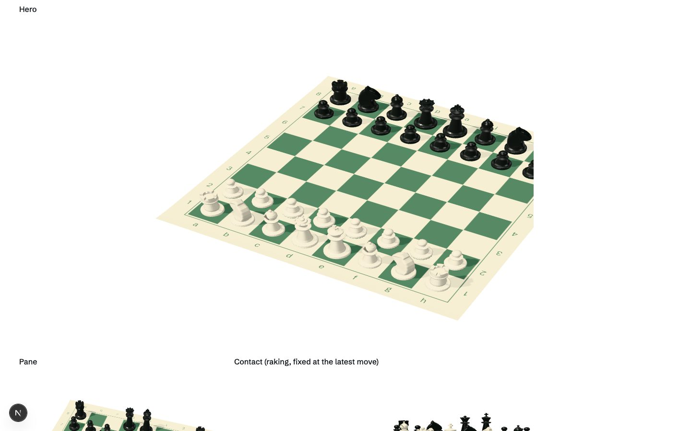
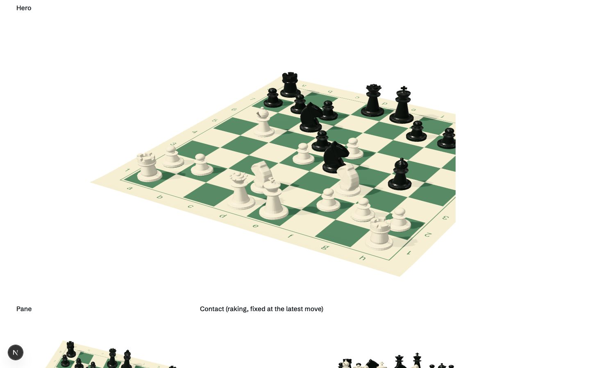
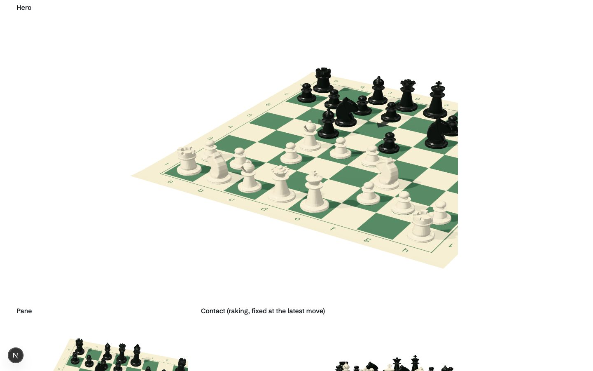
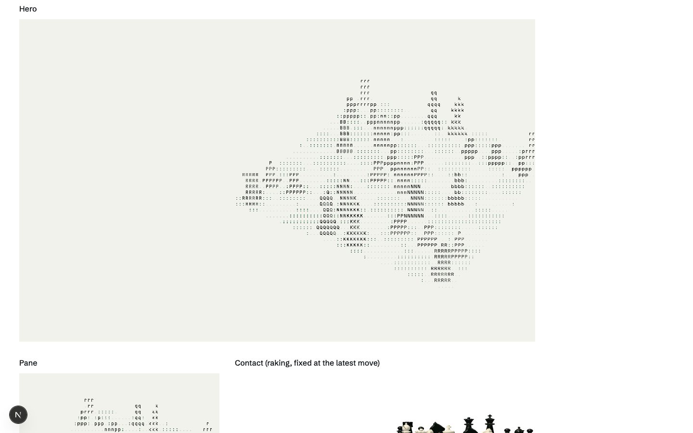
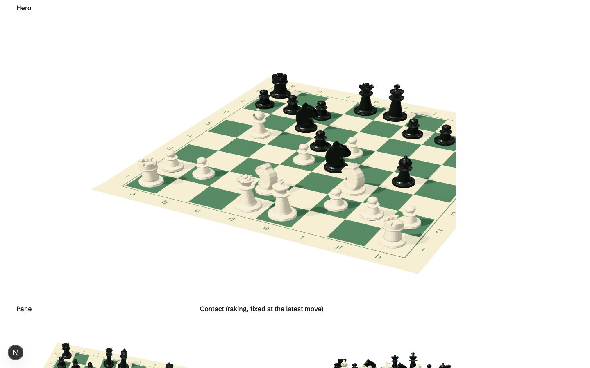
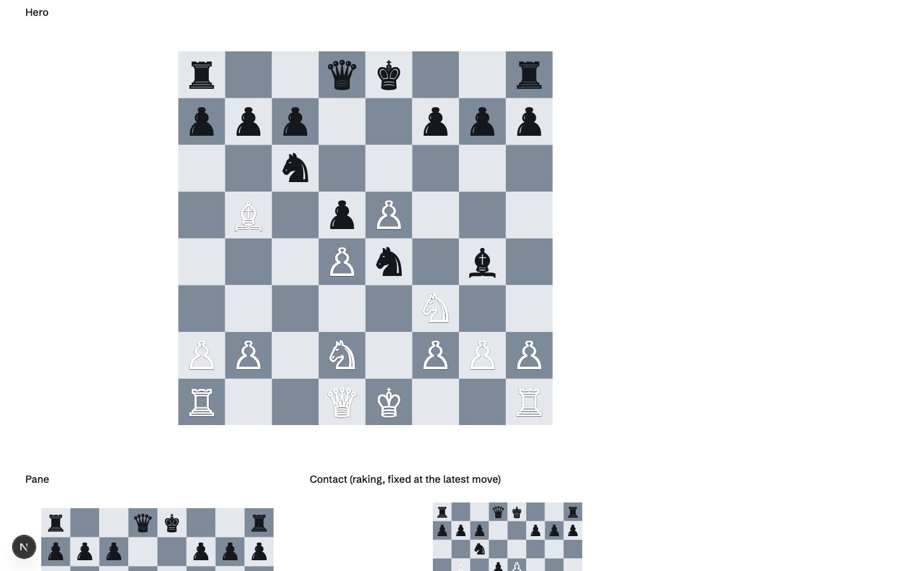

# Phase 2: board prototype (Review gate B)

Status: **gate B passed on the owner's standing instruction** (take the recommendation, continue to the next phase).

Route: `/lab/board-prototype` (`noindex`, not linked, not in the sitemap). The live site is otherwise unchanged in this phase.

## What was built

| Brief item (§11 Phase 2) | Where | State |
|---|---|---|
| Static position | `BoardBox` + `components/board3d` | ✅ The real 10…Bg4 position, from `game.ts` via `lib/board/data.ts` |
| Idle orbit | `CameraRig` | ✅ ±4° over 28 s. Only draws while its box is visible and the tab is shown, at about 30 fps. Off under reduced motion |
| Move replay from the real data | `Pieces` | ✅ Lift, then travel square by square on the house `place` curve, then settle. Captured pieces sink after the mover lands. Knights hop. ← → Home End step the mainline |
| Candidate arrows | `Arrows` | ✅ From the **game tree's real alternatives**: the siblings at the parent move, weighted by `CAREER_EVALS`, with the played move drawn bold. They fan out on hover or focus. After "Start engine" they become the principal variation (wired in Phase 4) |
| Opening sequence with skip | `BoardView` + `CameraRig` | ✅ 20 plies at a 135 ms stagger, about 2.9 s, with a camera push-in from high and wide. Wheel, touch, a key, a click or a scroll skips to the final position. Once per session (`sessionStorage`). Never under reduced motion |
| Engine view character render | `Glyphs` | ✅ An ID pass (object class to a low-res target, one texel per 9×15 px cell), then chess characters: `.` `:` squares, `KQRBNP` for White, `kqrbnp` for Black, `+` for the engine line and search. A custom shader beat drei's `AsciiRenderer`: that one reads back the whole frame into DOM text each frame and cannot show which piece is which |
| Board cursor | `ChessCursor` + `HoverSquare` | ✅ Over a board: an exact, uneased legal-move dot, and the square under the pointer lit on the mat. Over `[data-cursor="piece"]` targets: a small knight beside the system pointer that steps on click. Fine pointers only, off under reduced motion |
| Reduced-motion fallback | everywhere | ✅ Positions swap instantly, no orbit, no opening, no push-in |
| No-WebGL fallback | `BoardBox` | ✅ The server-rendered printed diagram (`StaticBoard`) stays. No 3D chunk is requested |

| | |
|---|---|
|  Opening, mid-replay |  Settled at 10…Bg4 |
|  Candidates at 5. d4 (5…exd4, 5…d6?, 5…Bb6) |  Engine view |
|  Reduced motion: final position, no motion |  WebGL off: printed diagrams |

## Architecture as built

- **One persistent `<Canvas>`** (`board3d/BoardCanvas.tsx`):
  - Fixed, `z-index: -1` (under all content, over the page ground), `aria-hidden`, no pointer events.
  - `frameloop="demand"`: frames are drawn only while something moves or when scroll or resize moves a box.
- **drei `View`s**, one per registered DOM box. Each box has its own camera rig, lights and scene; geometry, materials and the environment map are shared.
- **Single store** (`lib/board/store.ts`, Zustand, outside React):
  - Holds the move as a `GameNode.id`, focus previews, box registry, readiness, engine line, engine view and takeback.
  - Everything reads from it: the 2D board, the 3D views, the chart and URL sync are wired to it in Phase 4.
- **Loading** (`board/BoardRuntime.tsx`):
  - `next/dynamic` with `ssr: false`.
  - Loads only when WebGL2 is available, Save-Data and `prefers-reduced-data` are off, a board box is within 200 px of the viewport, and the page is loaded and idle.
- **Readiness:** a box fades its diagram (`--t-reframe`) only after its view has *actually drawn into the box*, not merely rendered a frame somewhere else.
- **Quality governor:**
  - drei's `PerformanceMonitor` misreads a demand loop's idle gaps as low fps, so it was replaced.
  - The replacement counts only back-to-back animation frames. Two seconds under 45 fps turns shadows off, then drops DPR to 1.
  - DPR is clamped to [1, 2].

## Numbers

**Assets downloaded for 3D: 0 bytes.**
- Pieces are lathe-turned geometry.
- The mat, its grain and the ID map are canvas textures drawn at runtime.
- The environment is three's procedural `RoomEnvironment`.
- The §8 budget of 2.5 MB is untouched.

**JavaScript** (production build, gzip -9):

| | KB |
|---|---|
| Home initial JS (unchanged this phase) | 159.8 (baseline 159.7) |
| Lazy 3D chunk (three, R3F, drei `View` and camera, scene code) | 238 |
| Prototype route initial (HTML-referenced) | 191.4 |

The lazy chunk never loads on routes without a board box, under Save-Data, or without WebGL2.

**Frame rate** (continuous drawing via `?fps`; Apple M2 Pro through ANGLE Metal in headless Chromium; the 120 fps cap is the harness's):

| Configuration | fps | Draw calls/frame | Triangles/frame |
|---|---|---|---|
| Hero + pane + raking visible, shadows, DPR 1 | 120 | 256 | 399k |
| Same, DPR 2 | 120 | 256 | 399k |
| Engine view on (extra ID pass) | 120 | 316 | 547k |
| Hero only, candidate arrows | 120 | 99 | 146k |
| 390×844 at DPR 2 | 120 | 256 | 399k |

- **Not measured:** a mid-range Android. There is none on this machine, and headless Chrome on the owner's Mac is closed by the managed browser profile after about 5 s (the same failure Lighthouse hit in Phase 0). The governor is the guard.
- **Cut for Phase 4:** the draw-call count. About 85 calls per view comes from 32 pieces × (piece + felt + slit) plus the shadow pass. Phase 4 moves pieces to six instanced meshes per colour, as the brief asks.

## 3D eval path (ribbon or terrain between sections): **cut**

- It adds a second 3D object, and the brief wants the boldness in one place.
- A camera travelling between sections behaves like scroll-jacking (§5).
- It repeats what the 2D chart and its table already say more clearly. The chart has 18 points on a time axis; a terrain loses the axis labels.
- The 2D chart and the table stay as they are.

## Issues found and fixed during the prototype

- **Arrows** were drawn in tournament green, which vanished on the dark squares. They are now ink at 42% (78% for the played move), as chess books print them.
- **Engine view:**
  - Every piece printed as `K`: R3F re-applies the `userData` prop on each render and wiped the stored piece type. The type now lives in a ref.
  - The view's colours came out too dark, because the shader wrote linear output with no sRGB conversion. It now includes `colorspace_fragment`.
- **Readiness:** boxes that were offscreen marked themselves ready and faded their diagram before the 3D had drawn there. Readiness now requires the box to be on screen.

## Carried into Phase 3 and Phase 4

- Instanced pieces (draw calls).
- Wire the real engine: `AnalysisBoard` writes its principal variation and search state to the store. The engine files stay vendor unchanged.
- The procedural knight is stylised. A CC0 model would look better, but it is a download, and the owner's standing rule is "no downloads", so it is not done.
