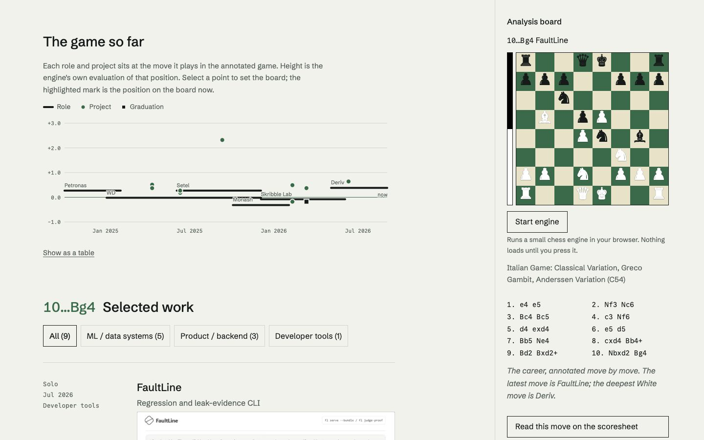
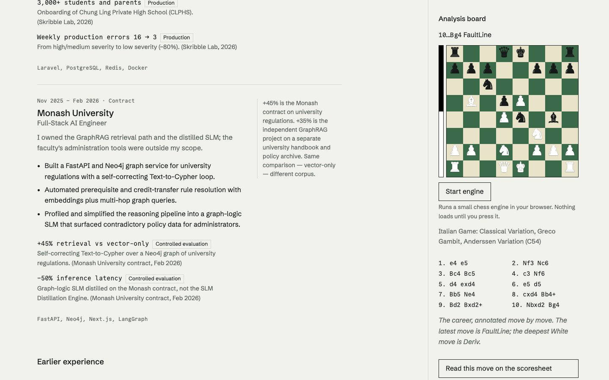

# Phase 3: motion system (Review gate C)

Status: **gate C passed on the owner's standing instruction.** Applied to the home page, as §11 requires. The tokens (palette and type) are site-wide, because they live in `@theme`.

## Built

| Brief item | Where | Notes |
|---|---|---|
| Lenis + GSAP ticker | `components/motion/motion-core.ts` | `autoRaf: false`; `lenis.raf` runs from `gsap.ticker`; `lenis.on("scroll", ScrollTrigger.update)`; `lagSmoothing(0)`. Fine pointers at ≥ 1024 px only; native scroll on touch. `anchors: true` keeps in-page links working |
| Attribute registrar | `startMotion().attach(root)` | One function reads `[data-fx]` and attaches `annotate`, `margin` or `settle`. `MotionRuntime` re-attaches after every route or query change and cleans up the previous effects. No `gsap.to` calls live in components |
| Annotation title reveal | `SectionTitle` + `annotate` | Move number, then move, then glyph where the node has one, then the title's words, each behind a mask (SplitText `mask: "words"`). The notation comes from the game (`content/site/sections.ts`: work → 10…Bg4, experience → 10. Nbxd2, education → 8. cxd4, contact → 11. …) and is `aria-hidden`, so each heading's accessible name is unchanged. Major titles only |
| Margin annotations | `.margin-note` + `margin` | ≥ 1280 px: a 12.5 rem margin column beside the entry, with a hairline rule. It slides 24 px once, at reading pace (`--t-reframe`), then stays. Below 1280 px it is inline, where it always was, with no motion. Existing copy only: `RETRIEVAL_SPLIT` (beside Monash) and `OVERLAP_NOTE` (beside "Earlier experience") |
| House easing and durations | `lib/motion/tokens.ts`, `site.css :root` | `place` = `cubic-bezier(0.6, 0, 0.2, 1)`, registered as GSAP `CustomEase("place")`; `--t-tap` 120 … `--t-push` 900 ms |
| Phase 1 tokens | `site.css @theme`, `fonts.ts` | Paper, ink, pencil, hairline, green and buff (old names kept as aliases). Literata retired; commentary is Schibsted Grotesk italic. Tabular figures on notation, claims, dates, readouts and chart ticks. Board states (focus, selection, legal-move dots) drawn in ink, because the accent is now a board colour |

## Rules it keeps

- **Nothing hides content before JS.**
  - Effects set their hidden start state only when they run.
  - Effects skip anything already on screen when the page arrives.
  - Pages read fully with JS off (`launch.spec.ts` no-JS and no-CSS reading still pass).
- **Reduced motion:** the core never loads, so there is no Lenis, no splits and no reveals. `document.getAnimations()` stays at zero (launch check passes).
- **Loaded after `load` + idle** (`requestIdleCallback`, 2 s timeout).
  - Home initial JS is **160.2 KB** gzipped (baseline 159.7; cap 189.7).
  - GSAP, ScrollTrigger, SplitText, CustomEase and Lenis are all in the lazy chunk.

## Deviation, with reason

The brief's third margin example, Deriv's "running in staging, not production", stays attached to its claim line. `REBUILD_BRIEF.md` never lets a qualifier sit apart from its number. Moving it would also have meant showing it twice, since the claim line prints it. The margin carries the two standalone notes.

## Fix found by the tests

- **Problem:** forced-colours axe failed on the primary buttons. Paper text measured 1.12:1 against a forced white background. The old pure-white text measured exactly 1:1, which axe files as "incomplete" rather than a violation.
- **Fix:** a `forced-colors` block gives the primary buttons the system `ButtonFace`/`ButtonText` pair, and hides the chess cursor.

## Verification

- `npx vitest run`: 134/134.
- `npx playwright test` against the production build: 102/102.
- `npx tsc --noEmit` and ESLint: clean.
