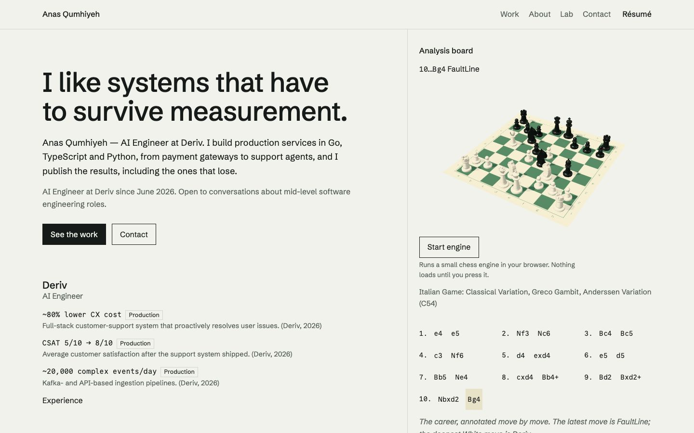
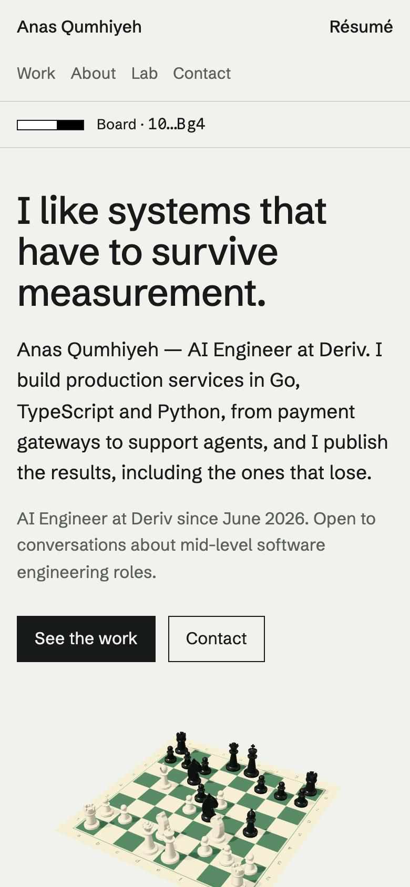
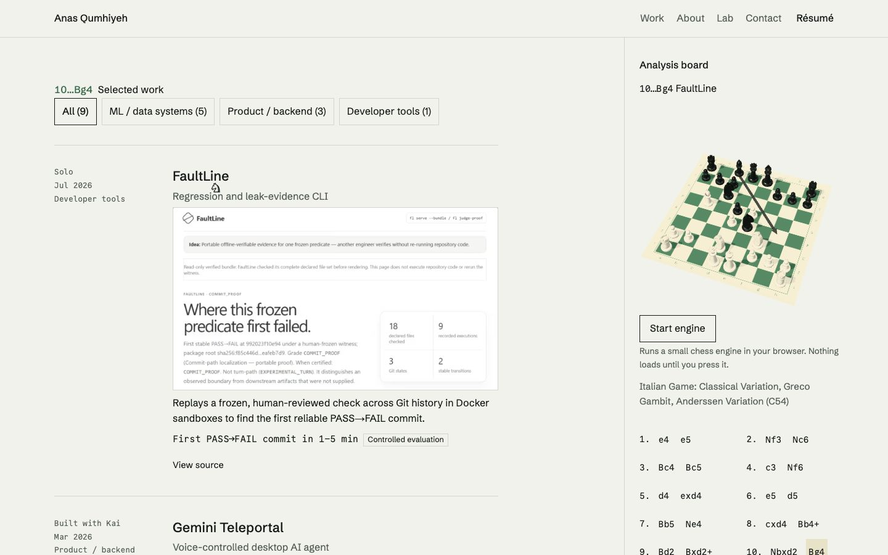
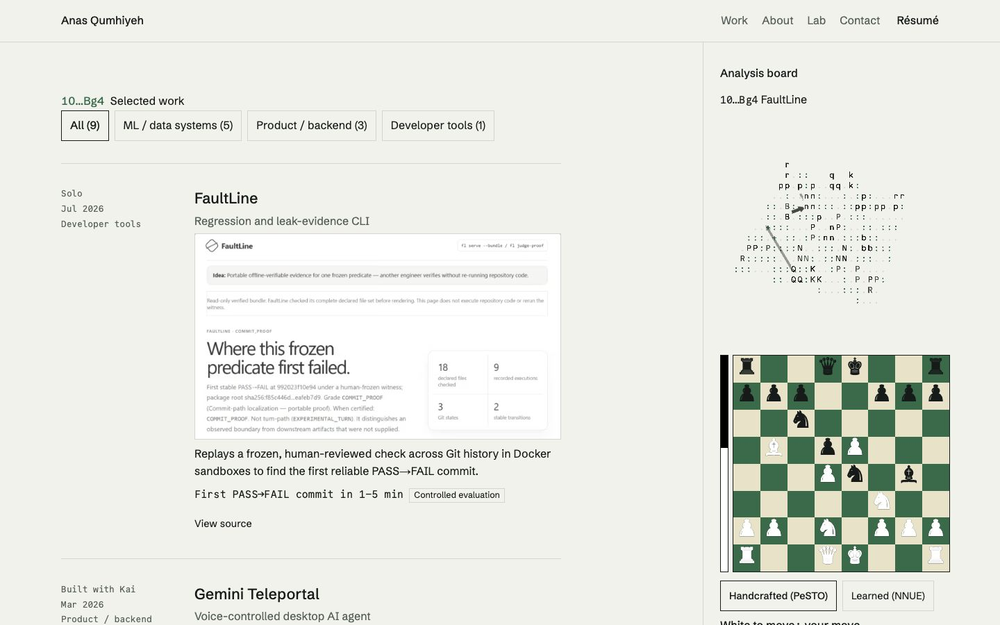
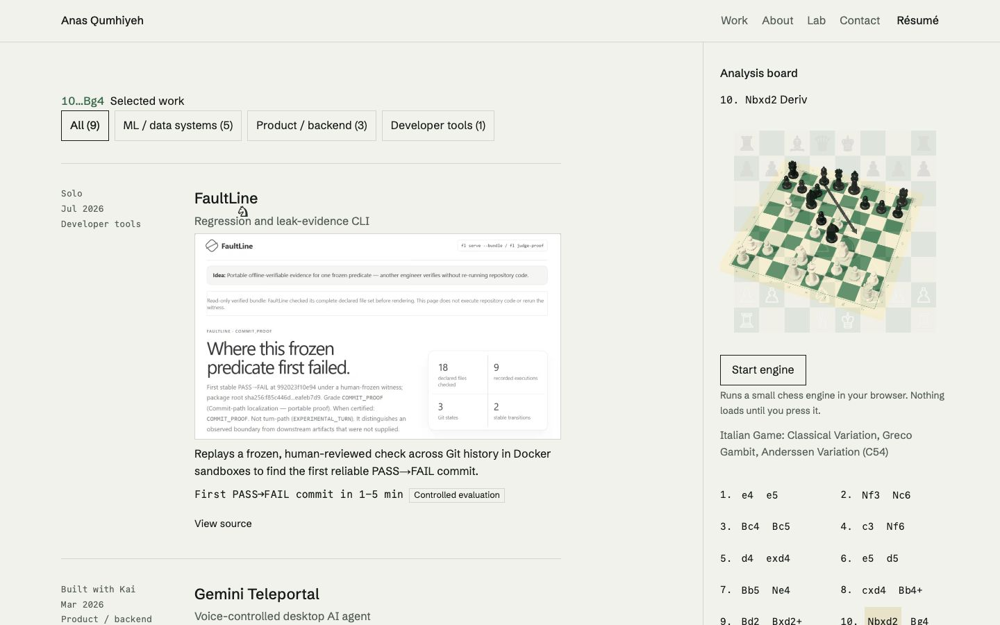
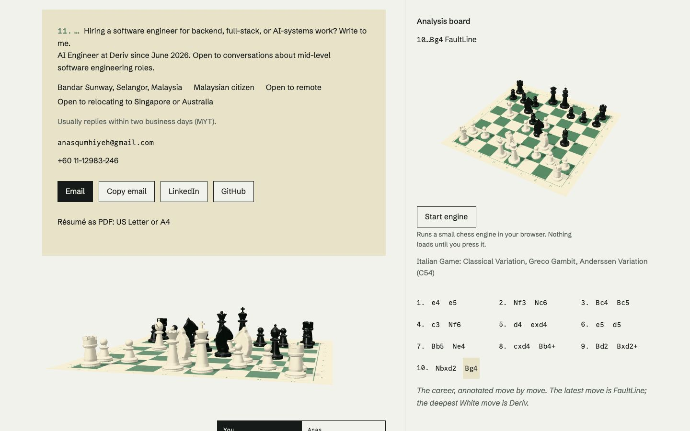
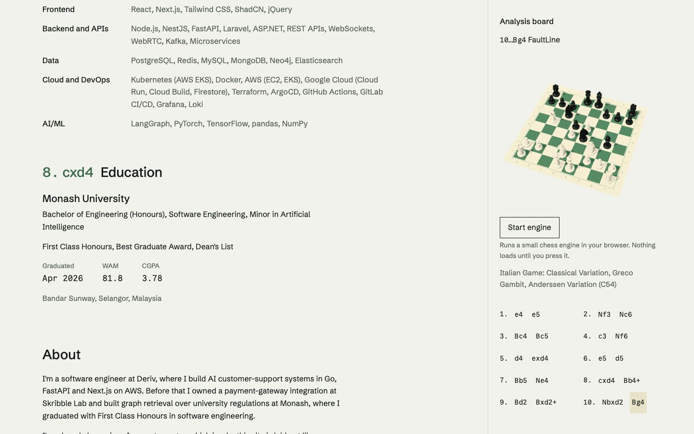

# Phase 4: integration (Review gate D)

Status: **gate D passed on the owner's standing instruction.** The board, motion and ending from Phases 2 and 3 now run on every route, over the new information architecture (brief §6).

## Built

| Brief item | Where | Notes |
|---|---|---|
| Information architecture | `app/(site)/page.tsx`, `work/`, `about/`, `lab/page.tsx` | `/` is the overview: headline, the three strongest Deriv proof points, the way onward, the contact ending. Selected work, the profile and the lab have their own pages. Header: Work, About, Lab, Contact |
| Old anchors keep working | `HashRedirect` | A nonce'd inline script maps every old fragment on `/` (sections, roles and their claims, projects and their claims, the lab claim) to its new page, on load and on `hashchange`. `/archive` → `/work#archive` (308). `/?path=` → `/work?path=` (307). `/?move=` and `/?tape=` still go to the scoresheet |
| One board, every page | `BoardRuntime` in the layout, `lib/board/store.ts` | One persistent canvas behind the content. Every page registers boxes; each draws its printed diagram until the 3D has drawn that box |
| Board follows reading | `BoardFollow` | On `/work` and `/about` the board shows the move of the entry at the reading line. Quiet for 1.4 s after arrival, so a deep link does not jump the board |
| Move list | `MoveList` | The mainline from the server, so it is in the HTML before any script. 44 px targets; ← → step and Home/End jump inside the list only |
| Home board state in the URL | `BoardUrlSync` | `?at=<move>` written with `replaceState` on user moves only. The latest move is the default and removes the parameter. `?move=` stays a scoresheet link (AUDIT.md decision 1) |
| Candidate arrows | `MoveLink`, `BoardView` preview | Hover or keyboard focus on a project or role shows the parent position with every candidate from the game tree, the played move drawn strong. 160 ms intent delay |
| Engine view | `AnalysisBoard linked`, `Glyphs.tsx` | Starting the engine turns the pane's board into chess characters and draws the engine's principal variation as arrows (SAN converted to plies with the engine's own legal-move list). The engine still loads only on the button |
| Project open and takeback | `MoveLink`, `FrontGame`, `BoardView` | Clicking a project with the board on screen plays the project's move (about 1 s), then navigates. Coming back takes the move back. Plain link with a modifier key, under reduced motion, or when no live board is on screen |
| "Your move" ending | `Contact`, `ChessClock` | The contact copy, word for word, on a buff scoresheet slip that settles as it scrolls in; a raking board fixed at the latest move with White to move; a chess clock with the visitor's time running and Anas's in Malaysia (`aria-hidden`) |
| Annotated titles and margin notes | `SectionTitle`, `Experience`, `RoleEntry` | Phase 3's system on `/work`, `/about` and the ending |

## Deviations, with reasons

- **The hero board is the sticky pane, not a full-bleed canvas (Phase 1 option B).** With the overview this short, a full-bleed board pushed the proof points below the fold on laptop screens. The pane is 38 vw at ≥ 1280 px. Phones get a board under the headline instead. With nothing overlaying a board, the lens shift from Phase 1 §3 had no job left, and it was clipping the contact board in its column, so it is gone.
- **The career graph lives on `/about`**, beside the roles it charts, not on the overview.
- **`/?path=` redirects with 307, not 308.** It is a query redirect done by the page (`redirect()`), and it must not be cached as permanent in case the filter moves again.
- **The contact board fits its column.** The approved Phase 1 raking render bleeds off the viewport edge; in a column that reads as clipping.

## Budget work found by measurement

The first full Lighthouse matrix passed every route except home on mobile: **Perf 86, TBT 296 ms** (baseline 9 ms). Mobile LCP had also crept up on the project page. Fixes, each measured:

1. **The 3D loads in short tasks.** `lib/idle.ts` queues the lazy layers after `load`, the first paint and an idle period, one layer per idle period. The loader evaluates three and R3F, builds each piece and texture, then mounts, with a yield between every step (`board3d/warm.ts`). The environment map is built in an effect instead of during React's render. The board's shaders are compiled with `compileAsync` against a stand-in scene before the views mount, and the environment is set in a layout effect, so the first frame reuses them (5 programs linked on the first frame before, 2 after). The mat's print is 1024 px unless the screen can use 2048.
2. **Motion has no page-wide measuring.** The one-shot reveals (titles, margin notes) start from an IntersectionObserver instead of ScrollTrigger, so there is no `refresh()` forcing layout of the whole page. The scoresheet's scrubbed settle is a CSS scroll-driven animation (off under reduced motion; static where unsupported). ScrollTrigger is no longer loaded.
3. **The italic is a static 25 KB cut.** Commentary is in most pages' first HTML, so its face is on the critical path to first paint. The variable italic (48 KB, preloaded) delayed the project page's LCP image. Not preloading it delayed first paint on board pages instead. It is now the variable italic instanced at 400, the only weight commentary uses (OFL; no reserved font name), and preloaded.
4. **LCP images load first.** The first project screenshot and the first `/work` card use `fetchPriority="high"` (`priority` is deprecated in Next 16). The `/work` card was lazy-loaded and was the LCP element on phones.

Result on home, mobile: Perf **93** in five of five runs, TBT 113 ms median. The largest task after load is 78 to 141 ms under Lighthouse's software GL.

## Measurements

Local production build, Lighthouse 12.8.2, Chrome for Testing 151 headless (the managed system Chrome closes automated sessions). Mobile is the default Moto G Power emulation on slow 4G; desktop is `--preset=desktop`. Median of 3.

| Route | Form | Perf | A11y | Best practices | SEO | LCP | CLS | TBT | FCP |
|---|---|---|---|---|---|---|---|---|---|
| `/` | mobile | **93** | 100 | 100 | 100 | 3.09 s | 0.000 | 110 ms | 1.22 s |
| `/` | desktop | 100 | 100 | 100 | 100 | 0.67 s | 0.000 | 0 ms | 0.33 s |
| `/work` | mobile | 92 | 100 | 100 | 100 | 3.39 s | 0.000 | 12 ms | 1.22 s |
| `/work` | desktop | 100 | 100 | 100 | 100 | 0.69 s | 0.001 | 0 ms | 0.33 s |
| `/about` | mobile | 94 | 100 | 100 | 100 | 3.09 s | 0.018 | 12 ms | 1.21 s |
| `/about` | desktop | 100 | 100 | 100 | 100 | 0.67 s | 0.000 | 0 ms | 0.33 s |
| `/lab` | mobile | 95 | 100 | 100 | 100 | 2.93 s | 0.013 | 10 ms | 1.21 s |
| `/lab` | desktop | 100 | 100 | 100 | 100 | 0.59 s | 0.000 | 0 ms | 0.33 s |
| `/projects/faultline` | mobile | 92 | 100 | 100 | 100 | 3.31 s | 0.000 | 10 ms | 1.21 s |
| `/projects/faultline` | desktop | 100 | 100 | 100 | 100 | 0.69 s | 0.000 | 0 ms | 0.33 s |

Baseline (AUDIT.md §4): `/` mobile 96, LCP 2.71 s, TBT 9 ms; `/projects/faultline` mobile 97, LCP 2.64 s. CLS stays under 0.05 everywhere (§8).

**Mobile LCP** stays above 2.5 s on every route, as it already did in the baseline (AUDIT.md §4: 2.71 s and 3.23 s modes on `/`). The render delay is the framework's own JavaScript under simulated throttling. The owner's production run measured 2.1 s. AUDIT.md's recommendation stands: the §8 gate is the production PageSpeed run and field data.

**JavaScript** (gzip level 9):
- Home, scripts in the HTML: **197.1 KB**. Master measured the same way: 198.2 KB. The §8 cap is +30 KB.
- After load: 303.9 KB gzipped (1.08 MB decoded) for three, R3F, drei, the board, GSAP, SplitText and Lenis.
- 3D assets: no model or texture files at all. The pieces are lathe profiles in code and the mat is drawn in code; 1.08 MB decoded is under the 2.5 MB budget before compression.

## Verification

- `npx vitest run`: 134/134.
- `npx playwright test` against the production build: 108/108.
- `npx tsc --noEmit` and ESLint on `src` and `e2e`: clean.
